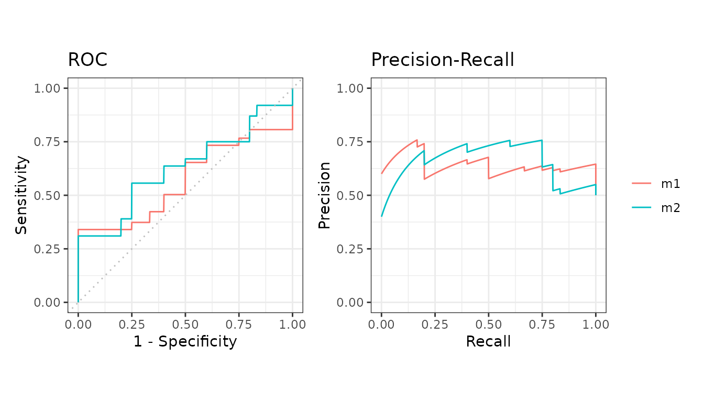

# Evaluate cross-validation folds

Cross-validation folds are just several test sets, so everything on
[averaging over test
sets](https://evalclass.github.io/precrec/articles/howto-multiple-test-sets.md)
applies. The only extra step is getting your data out of a data frame.

``` r

library(precrec)
library(ggplot2)
```

## The usual shape of the data

`M2N50F5` holds two models scored on 5 folds - one column per model, one
label column and one fold column.

``` r

data(M2N50F5)

knitr::kable(head(M2N50F5))
```

|     score1 |     score2 | label | fold |
|-----------:|-----------:|:------|-----:|
|  2.0606025 |  1.0689227 | pos   |    1 |
|  0.3066092 |  0.1745491 | pos   |    3 |
|  1.5597733 | -1.5666375 | pos   |    1 |
| -0.6044989 |  1.1572727 | pos   |    3 |
| -0.2229031 |  0.6070042 | pos   |    5 |
| -0.7679551 | -1.7908147 | pos   |    5 |

## Straight into evalmod

[`evalmod()`](https://evalclass.github.io/precrec/reference/evalmod.md)
and
[`mmdata()`](https://evalclass.github.io/precrec/reference/mmdata.md)
both take the fold columns directly. This is the short way.

``` r

curves <- evalmod(
  nfold_df = M2N50F5, score_cols = c(1, 2),
  lab_col = 3, fold_col = 4,
  modnames = c("m1", "m2"), dsids = 1:5
)

autoplot(curves)
```



Column names work as well as positions.

``` r

curves2 <- evalmod(
  nfold_df = M2N50F5,
  score_cols = c("score1", "score2"),
  lab_col = "label", fold_col = "fold",
  modnames = c("m1", "m2"), dsids = 1:5
)
```

## Converting first

[`format_nfold()`](https://evalclass.github.io/precrec/reference/format_nfold.md)
does the conversion on its own if you want the lists for something else.

``` r

folds <- format_nfold(
  nfold_df = M2N50F5, score_cols = c(1, 2),
  lab_col = 3, fold_col = 4
)

curves3 <- evalmod(
  scores = folds$scores, labels = folds$labels,
  modnames = rep(c("m1", "m2"), each = 5),
  dsids = rep(1:5, 2)
)
```

## Reading the result

Each model gets one averaged curve with a confidence band across the
folds.

``` r

knitr::kable(auc_ci(curves))
```

| modnames | curvetypes |      mean |     error | lower_bound | upper_bound |   n |
|:---------|:-----------|----------:|----------:|------------:|------------:|----:|
| m1       | ROC        | 0.5696667 | 0.2810846 |   0.2885820 |   0.8507513 |   5 |
| m1       | PRC        | 0.6410081 | 0.2105395 |   0.4304686 |   0.8515476 |   5 |
| m2       | ROC        | 0.6280000 | 0.1870468 |   0.4409532 |   0.8150468 |   5 |
| m2       | PRC        | 0.6529690 | 0.1998983 |   0.4530706 |   0.8528673 |   5 |

## Next

- [Average over several test
  sets](https://evalclass.github.io/precrec/articles/howto-multiple-test-sets.md)
- [Get the numbers
  out](https://evalclass.github.io/precrec/articles/howto-results-as-data.md)
