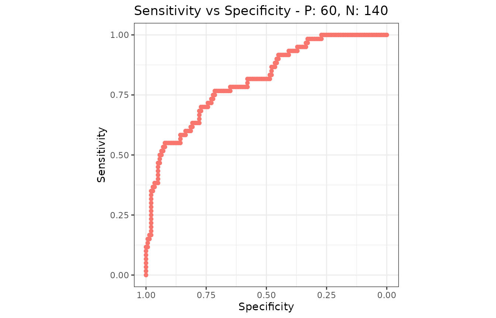

# Coming from pROC or ROCR

A translation table. If you already have working `pROC` or `ROCR` code
and want the same numbers out of `precrec`, this page is the mapping.
[Comparison with other
tools](https://evalclass.github.io/precrec/articles/metrics-other-tools.md)
is the argument about which to use; this one assumes you have decided.

Every equivalence below was checked against `pROC` 1.19.1 and `ROCR`
1.0.12. Neither is a dependency of `precrec`, so their code is shown but
not run when this page is built - only the `precrec` chunks are.

``` r

library(precrec)

set.seed(7)
scores <- c(rnorm(60, 1.1), rnorm(140, 0))
labels <- rep(c(1, 0), c(60, 140))
mdat <- mmdata(scores, labels)
```

## One object instead of one per question

This is the difference that shapes everything else. `pROC` builds a
`roc` object and asks it questions; `ROCR` builds a `prediction` and
then a `performance` object per metric pair. `precrec` calculates the
curves and the per-cutoff metrics once, and every function reads that
result.

``` r

# pROC: one object, one curve
r <- roc(labels, scores)
auc(r)
coords(r, "best")

# ROCR: a new performance object per question
p <- prediction(scores, labels)
performance(p, "tpr", "fpr")
performance(p, "prec", "rec")
performance(p, "auc")
```

``` r

curves <- evalmod(mdat)

auc(curves)
#>   modnames dsids curvetypes      aucs baselines
#> 1       m1     1        ROC 0.8102381       0.5
#> 2       m1     1        PRC 0.6897919       0.3
```

One call, both curves, and the ROC and precision-recall areas together.
The practical consequence is that `mdat` and `curves` are worth keeping
in a variable: everything else on this page reads one of them.

## pROC

| `pROC` | `precrec` |  |
|----|----|----|
| `roc(labels, scores)` | `evalmod(scores = , labels = )` | ROC and PRC together |
| `auc(r)` | `auc(curves)`, the `ROC` row | Identical |
| `ci.auc(r)` | `auc_ci(auc_delong(mdat))` | Identical - the same DeLong variance |
| `ci.auc(r, method = "bootstrap")` | `auc_ci(auc_boot(mdat))` | Percentile, and stratified |
| `roc.test(r1, r2)` | `auc_diff(auc_delong(mdat))` | Identical statistic and p-value |
| `roc.test(r1, r2, method = "bootstrap")` | `auc_diff(auc_boot(mdat))` | Paired on the same resamples |
| `coords(r, "best")` | `best_cutoff(mdat)` | Youden’s J, the default in both |
| `coords(r, "best", best.method = "closest.topleft")` | `best_cutoff(mdat, metric = "topleft")` |  |
| `coords(r, "all")` | `metric_table(mdat)` | Same rows, many more columns |
| `coords(r, t, input = "threshold")` | `classification_report(mdat, at = t)` |  |
| `auc(r, partial.auc = c(1, 0.8), partial.auc.focus = "sp")` | `pauc(part(curves, xlim = c(0, 0.2)))` | Identical, in the `paucs` column |
| `partial.auc.correct = TRUE` | The `spaucs` column | Both standardize; not the same way - see below |
| `plot(r)` | `autoplot(curves, "ROC")` | See the axis note below |
| `multiclass.roc(labels, scores)` | [`evalmod()`](https://evalclass.github.io/precrec/reference/evalmod.md) on more than two classes | [One-vs-rest](https://evalclass.github.io/precrec/articles/howto-multiclass.md) |
| `levels =`, `direction =` | `posclass =` |  |

`roc.test()` is worth spelling out, because it is the reason many people
have `pROC` loaded at all:

``` r

roc.test(roc(labels, a), roc(labels, b))   # DeLong, paired
```

``` r

two <- mmdata(
  list(scores, scores * 0.6 + rnorm(200, 0, 0.9)),
  list(labels, labels),
  modnames = c("A", "B")
)

knitr::kable(auc_diff(auc_delong(two)), digits = 4)
```

| curvetypes | modnames1 | modnames2 | diffs | lower_bound | upper_bound | z_values | p_values | n |
|:---|:---|:---|---:|---:|---:|---:|---:|---:|
| ROC | A | B | 0.1662 | 0.0838 | 0.2486 | 3.9542 | 1e-04 | 200 |

`z_values` and `p_values` here are `roc.test()`’s `Z` and `p-value`.
They are the same statistic computed the same way, and on this example
they agree to every digit either package prints.

## ROCR

| `ROCR` | `precrec` |  |
|----|----|----|
| `prediction(scores, labels)` | `mmdata(scores, labels)` |  |
| `performance(p, "tpr", "fpr")` | [`evalmod()`](https://evalclass.github.io/precrec/reference/evalmod.md), the `ROC` curve |  |
| `performance(p, "prec", "rec")` | [`evalmod()`](https://evalclass.github.io/precrec/reference/evalmod.md), the `PRC` curve | The numbers differ - see below |
| `performance(p, "auc")` | `auc(curves)`, the `ROC` row | Identical |
| `performance(p, "aucpr")` | `average_precision(curves)` | The step estimator; [`auc()`](https://evalclass.github.io/precrec/reference/auc.md) interpolates instead |
| `performance(p, "acc")`, `"err"`, `"mat"`, … | `metric_table(mdat)` | Identical, all at once |
| `performance(p, "prbe")` | `prbe(curves)` |  |
| `performance(p, "cost", cost.fp = , cost.fn = )` | `metric_table(mdat, metrics = "cost", cost_fp = , cost_fn = )` | Identical |
| `performance(p, "fall")`, `"miss"`, `"rpp"` | The same names, as aliases |  |
| `perf@x.values`, `perf@y.values` | `as.data.frame(curves)` |  |
| `p@cutoffs` | The `score` column of [`metric_table()`](https://evalclass.github.io/precrec/reference/metric_table.md) |  |
| `prediction(list, list)`, `plot(perf, avg = )` | `mmdata(dsids = )`, then [`evalmod()`](https://evalclass.github.io/precrec/reference/evalmod.md) | [Averaged by default](https://evalclass.github.io/precrec/articles/howto-multiple-test-sets.md) |

The one that replaces the most code is
[`metric_table()`](https://evalclass.github.io/precrec/reference/metric_table.md),
because `ROCR` returns one metric per `performance()` call and this
returns all of them:

``` r

performance(p, "acc")@y.values[[1]]
performance(p, "mat")@y.values[[1]]   # and once more per metric
```

``` r

tab <- metric_table(mdat)

head(tab[, c("rank", "score", "accuracy", "mcc", "precision", "sensitivity")])
#>   rank    score accuracy       mcc precision sensitivity
#> 1    0       NA    0.700        NA         1  0.00000000
#> 2    1 3.816752    0.705 0.1082834         1  0.01666667
#> 3    2 3.387247    0.710 0.1535221         1  0.03333333
#> 4    3 3.381452    0.715 0.1885020         1  0.05000000
#> 5    4 3.289978    0.720 0.2182179         1  0.06666667
#> 6    5 2.996067    0.725 0.2445998         1  0.08333333
```

The `score` column is `p@cutoffs` with one difference: `ROCR` puts `Inf`
first, for the cutoff that calls nothing positive, and `precrec` puts
`NA` there because no instance sits at rank `0`. The metrics on that row
are the same in both.

## Four things that will look wrong at first

### The precision-recall numbers do not match

They are not meant to. `ROCR` joins the raw precision-recall points with
straight lines; `precrec` interpolates between achievable points, which
is the reason the package exists. On the data above:

``` r

areas <- auc(curves)

knitr::kable(
  data.frame(
    interpolated = areas$aucs[areas$curvetypes == "PRC"],
    step = average_precision(curves)$aps,
    ROCR_trapezoid = 0.6980509
  ),
  digits = 5
)
```

| interpolated |   step | ROCR_trapezoid |
|-------------:|-------:|---------------:|
|      0.68979 | 0.6928 |        0.69805 |

The gap widens as the positives get rarer, and [Comparison with other
tools](https://evalclass.github.io/precrec/articles/metrics-other-tools.md)
shows it doing so. If you need the step estimator - `scikit-learn`’s
average precision, and what most papers report under that name - it is
[`average_precision()`](https://evalclass.github.io/precrec/reference/average_precision.md).
What `ROCR` draws has no counterpart here on purpose.

The ROC numbers, by contrast, agree exactly. If a ROC AUC has moved, it
is not the interpolation.

### Tied scores produce extra rows

`pROC` and `ROCR` have one row per distinct score. `precrec` has one row
per rank, so a run of tied scores gets a row per instance in the run,
and by default those rows split the run’s positives and negatives evenly
between them. That is what the curves need, and it is not what a
threshold does.

``` r

tied <- c(3, 3, 2, 2, 1, 1)
tied_labels <- c(1, 0, 1, 0, 1, 0)

held <- metric_table(
  scores = tied, labels = tied_labels, basic_ties = "hold"
)

knitr::kable(held[, c("rank", "score", "sensitivity", "specificity")])
```

| rank | score | sensitivity | specificity |
|-----:|------:|------------:|------------:|
|    0 |    NA |   0.0000000 |   1.0000000 |
|    1 |     3 |   0.3333333 |   0.6666667 |
|    2 |     3 |   0.3333333 |   0.6666667 |
|    3 |     2 |   0.6666667 |   0.3333333 |
|    4 |     2 |   0.6666667 |   0.3333333 |
|    5 |     1 |   1.0000000 |   0.0000000 |
|    6 |     1 |   1.0000000 |   0.0000000 |

`basic_ties = "hold"` gives every cutoff in a run the counts of the
whole run, which is the tie policy the other two packages use: the seven
rows above hold four distinct ones, and those four are the four rows of
`coords(r, "all")`. Pass it whenever the scores are rounded, binned or
voted - and pass it to
[`best_cutoff()`](https://evalclass.github.io/precrec/reference/best_cutoff.md)
too, so the threshold it picks is one a threshold can produce.

### The threshold is named differently

`coords(r, "best")` reports a midpoint between two neighboring scores.
[`best_cutoff()`](https://evalclass.github.io/precrec/reference/best_cutoff.md)
reports an observed score, and the rule is `score >=` it.

``` r

knitr::kable(
  best_cutoff(mdat)[, c("metric", "value", "rank", "score", "sensitivity")],
  digits = 4
)
```

| metric       | value | rank |  score | sensitivity |
|:-------------|------:|-----:|-------:|------------:|
| informedness | 0.481 |   86 | 0.6795 |      0.7667 |

The two name the same cutoff: every instance separates the same way, and
the sensitivity and specificity are identical. Only the number written
down as the threshold differs, and `precrec` uses a value the data
actually contains so that it can be applied without a rounding decision.

### The standardized partial AUC is standardized differently

Both packages report a partial AUC and a standardized version of it, and
the two standardized numbers answer different questions.

`precrec` divides the partial area by the area of the box the region
occupies, so `spaucs` is the fraction of what was available that the
curve covered. `pROC`, with `partial.auc.correct = TRUE`, applies what
the literature calls the McClish correction, which rescales the interval
between chance and perfect onto `0.5` to `1` - so a corrected partial
AUC reads on the same scale as a full one.

The difference is where chance sits. Over false positive rates up to
`0.2`, a coin flip covers an area of `0.02`: that is `0.1` of the box,
and `0.5` after the correction.

``` r

region <- 0.2 # false positive rates 0 to 0.2
areas <- pauc(part(curves, xlim = c(0, region)))
roc_row <- areas[areas$curvetypes == "ROC", ]

chance <- region^2 / 2

knitr::kable(
  data.frame(
    paucs = roc_row$paucs,
    spaucs = roc_row$spaucs,
    corrected = 0.5 * (1 + (roc_row$paucs - chance) / (region - chance))
  ),
  digits = 5
)
```

|   paucs |  spaucs | corrected |
|--------:|--------:|----------:|
| 0.09774 | 0.48869 |   0.71594 |

`paucs` is the number `pROC` gives uncorrected, to the last digit. The
last column is the conversion, and it is the number
`partial.auc.correct = TRUE` returns - so a corrected value can be had
here without `pROC` installed. The formula holds for a ROC region
measured from a false positive rate of `0`; a region that starts
elsewhere needs the area under the diagonal across it in place of
`region^2 / 2`.

Neither is the right one. `spaucs` is the more direct reading of “how
much of this corner did the curve fill”; the corrected one is the more
comparable to a full AUC. Say which you used.

## The axes

`plot(roc)` puts specificity on the x axis and reverses it, so the curve
runs from the bottom right.
[`autoplot()`](https://evalclass.github.io/precrec/reference/autoplot.md)
puts `1 - specificity` on it, increasing left to right, which is the
orientation the precision-recall plot beside it uses.

Same curve, same area, different tick labels - and if the other one is
what your readers expect,
[`metric_curve()`](https://evalclass.github.io/precrec/reference/metric_curve.md)
will draw it:

``` r

library(ggplot2)

sn_sp <- metric_curve(
  scores = scores, labels = labels,
  x_metric = "specificity", y_metric = "sensitivity"
)

autoplot(sn_sp) + scale_x_reverse()
```



## What has no equivalent

Honestly, and in the order they are missed:

- **Curve smoothing.** `smooth(roc)` has no counterpart, deliberately: a
  smoothed curve is a model of the data rather than a summary of it.
- **Venkatraman’s test**, and tests at a fixed sensitivity or
  specificity.
  [`auc_diff()`](https://evalclass.github.io/precrec/reference/auc_diff.md)
  compares areas.
- **Unpaired comparison.** Both
  [`auc_boot()`](https://evalclass.github.io/precrec/reference/auc_boot.md)
  and
  [`auc_delong()`](https://evalclass.github.io/precrec/reference/auc_delong.md)
  require the models to be scored on the same instances.
- **Confidence bands from one test set.** `ci.se()` and `ci.sp()` have
  no counterpart; [confidence
  bands](https://evalclass.github.io/precrec/articles/plots-confidence-bands.md)
  here come from several test sets, and
  [`auc_boot()`](https://evalclass.github.io/precrec/reference/auc_boot.md)
  covers the single-sample case for the area rather than for the curve.
- **Sample size calculation.** `power.roc.test()` has no counterpart.
- **`ROCR`’s convex hull, expected-cost curve and calibration error**
  (`"rch"`, `"ecost"`, `"cal"`), each a curve in a space of its own
  rather than a column of the metric table.
- **Coloring a curve by its cutoff.** `plot(perf, colorize = TRUE)` has
  no direct counterpart; [one metric against
  another](https://evalclass.github.io/precrec/articles/plots-metric-curve.md)
  is the nearest thing.

## Next

- [Comparison with other
  tools](https://evalclass.github.io/precrec/articles/metrics-other-tools.md) -
  which to use, and where the numbers differ
- [Get the numbers
  out](https://evalclass.github.io/precrec/articles/howto-results-as-data.md) -
  [`metric_table()`](https://evalclass.github.io/precrec/reference/metric_table.md)
  and the long form
- [Choose an operating
  point](https://evalclass.github.io/precrec/articles/howto-operating-point.md) -
  what `coords(x, "best")` becomes here
- [Balanced and imbalanced
  data](https://evalclass.github.io/precrec/articles/howto-imbalanced-data.md) -
  why the cutpoint criterion matters more than it looks
