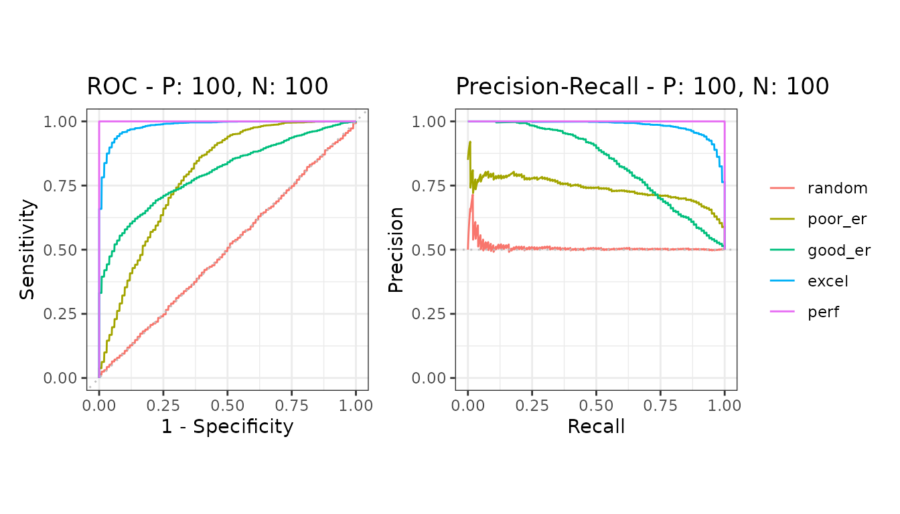
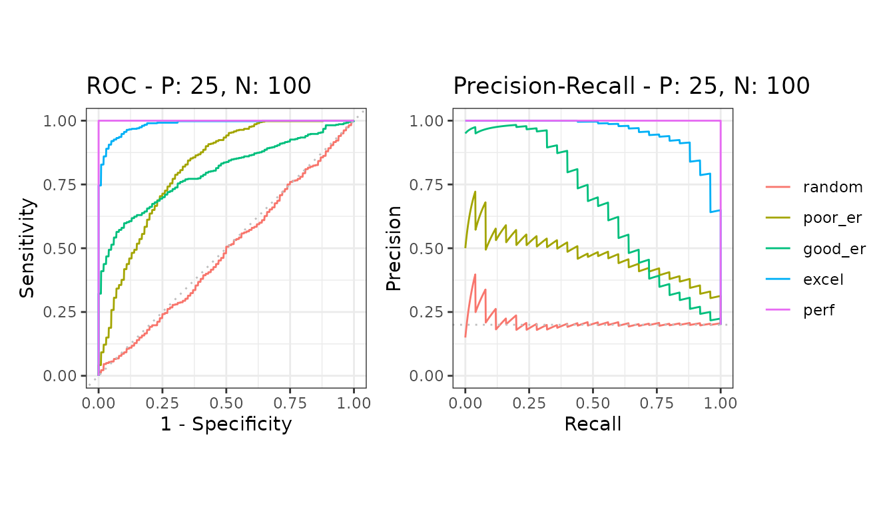

# Balanced and imbalanced data

This is the reason the package exists. When positives are rare, a ROC
curve can look excellent for a classifier that is not usable, while the
precision-recall curve shows the problem plainly.

``` r

library(precrec)
library(ggplot2)
```

## Two datasets, same models

The only difference between them is the class balance: 100 positives
against 100 negatives, and 25 positives against 100 negatives.

``` r

balanced <- create_sim_samples(20, 100, 100, "all")
imbalanced <- create_sim_samples(20, 25, 100, "all")

bdat <- mmdata(balanced[["scores"]], balanced[["labels"]],
  modnames = balanced[["modnames"]], dsids = balanced[["dsids"]]
)
idat <- mmdata(imbalanced[["scores"]], imbalanced[["labels"]],
  modnames = imbalanced[["modnames"]], dsids = imbalanced[["dsids"]]
)
```

## Balanced

``` r

autoplot(evalmod(bdat))
```



## Imbalanced

``` r

autoplot(evalmod(idat))
```



## What changed

The ROC curves are almost identical between the two. The
precision-recall curves are not: every model drops, because precision
depends on how many negatives there are to be mistaken for positives,
and the ROC axes do not.

A ROC curve is therefore the wrong plot for reporting how a classifier
will behave on data where positives are rare - which is most screening,
detection and diagnostic problems.

## The baseline moves too

A precision-recall curve is read against its baseline, which sits at the
proportion of positives: 0.5 above, 0.2 in the imbalanced case. The same
curve means something different against a different baseline, which is
why the two plots above cannot be compared by eye alone.

## Further reading

- [The Precision-Recall Plot Is More Informative than the ROC Plot When
  Evaluating Binary Classifiers on Imbalanced
  Datasets](https://doi.org/10.1371/journal.pone.0118432) - the paper
  behind this package
- [Classifier evaluation with imbalanced
  datasets](https://classeval.wordpress.com/) - a companion site with
  practical tips

## Next

- [Evaluate more than two
  classes](https://evalclass.github.io/precrec/articles/howto-multiclass.md)
- [AUC and other curve
  summaries](https://evalclass.github.io/precrec/articles/metrics-auc.md)
