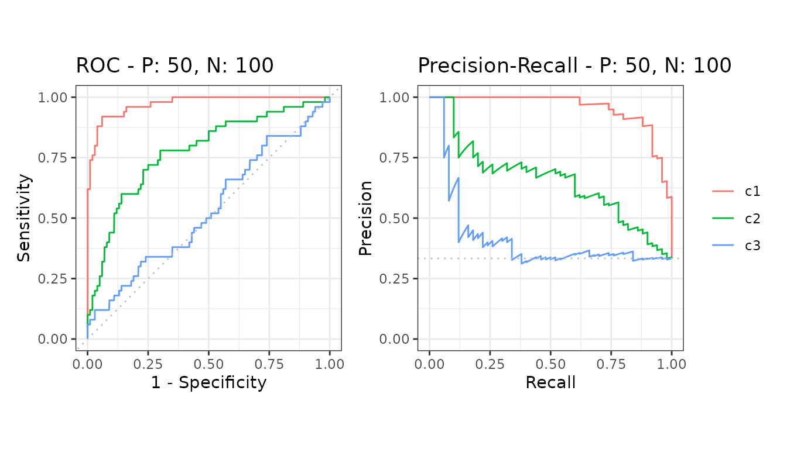

# Evaluate more than two classes

A dataset with more than two classes is evaluated by one-vs-rest
decomposition: each class becomes its own binary problem - that class
against all the others - so the accurate precision-recall calculations
apply to it unchanged.

``` r

library(precrec)
library(ggplot2)
```

## The input

Pass a matrix with one score column per class, together with the class
labels.

``` r

# A 3-class dataset with one score column per class
data(C3N150)

mdat <- mmdata(C3N150$scores, C3N150$labels)
mdat
#> 
#>     === Input data ===
#> 
#>      Model name Dataset ID Class # of negatives # of positives
#>    1         c1          1    c1            100             50
#>    2         c2          1    c2            100             50
#>    3         c3          1    c3            100             50
```

The decomposition is detected from the input. The classes are carried on
the model axis, so everything downstream treats them the way it treats
several models on one test set.

Add `multiclass = "ovr"` to ask for the decomposition explicitly. That
is worth doing when the score columns are not named after the classes -
they are then taken in the order of the class names.

## One curve per class

``` r

curves <- evalmod(mdat)

autoplot(curves)
```



## Per-class and macro-averaged areas

[`auc()`](https://evalclass.github.io/precrec/reference/auc.md) reports
one row per class and curve type, then the macro-average of the
per-class scores.

``` r

knitr::kable(auc(curves))
```

| modnames      | dsids | curvetypes |      aucs |
|:--------------|------:|:-----------|----------:|
| c1            |     1 | ROC        | 0.9732000 |
| c1            |     1 | PRC        | 0.9558435 |
| c2            |     1 | ROC        | 0.7758000 |
| c2            |     1 | PRC        | 0.6550357 |
| c3            |     1 | ROC        | 0.5336000 |
| c3            |     1 | PRC        | 0.4162555 |
| macro-average |     1 | ROC        | 0.7608667 |
| macro-average |     1 | PRC        | 0.6757116 |

## One thing to watch

Each one-vs-rest split has its own class balance, so the baseline of a
precision-recall curve differs from class to class. The plots leave the
baseline out for that reason - which matters here more than anywhere
else, because a precision-recall curve is read against its baseline.

## Next

- [Balanced and imbalanced
  data](https://evalclass.github.io/precrec/articles/howto-imbalanced-data.md)
- [AUC and other curve
  summaries](https://evalclass.github.io/precrec/articles/measures-auc.md)
