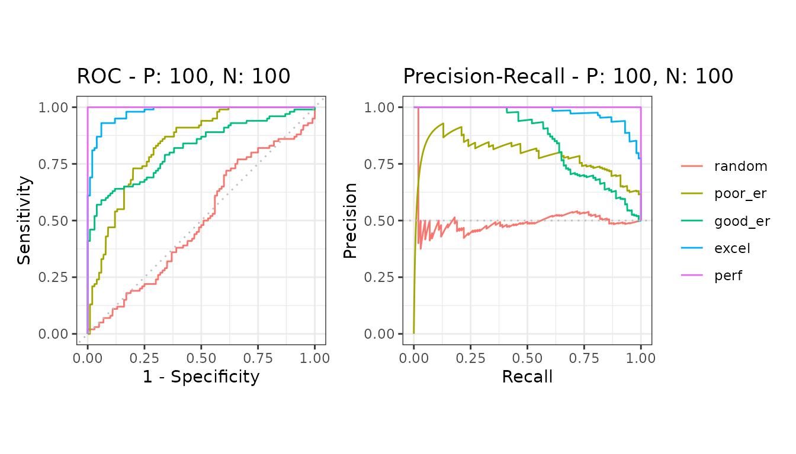
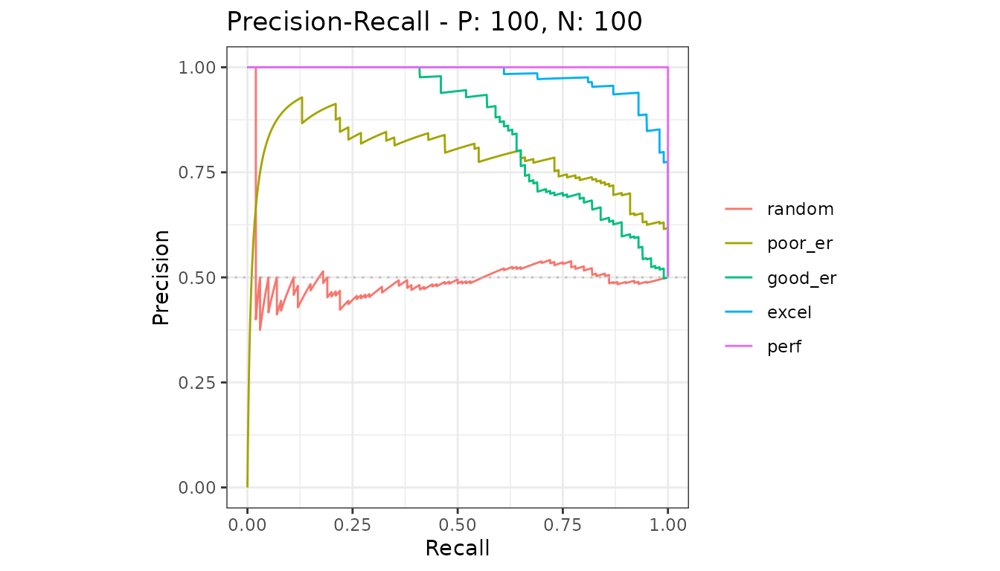

# Compare several models

Several models tested on the *same* data give one curve each, drawn
together on one plot.

``` r

library(precrec)
library(ggplot2)

samps <- create_sim_samples(1, 100, 100, "all")

mdat <- mmdata(samps[["scores"]], samps[["labels"]],
  modnames = samps[["modnames"]]
)
```

The five models here are the five simulated quality levels, from random
to perfect.

## Calculate and plot

[`evalmod()`](https://evalclass.github.io/precrec/reference/evalmod.md)
notices there is more than one model and labels the curves accordingly.

``` r

curves <- evalmod(mdat)

autoplot(curves)
```



## Compare the areas

``` r

knitr::kable(auc(curves))
```

| modnames | dsids | curvetypes |      aucs |
|:---------|------:|:-----------|----------:|
| random   |     1 | ROC        | 0.4971000 |
| random   |     1 | PRC        | 0.4992116 |
| poor_er  |     1 | ROC        | 0.8328000 |
| poor_er  |     1 | PRC        | 0.7860641 |
| good_er  |     1 | ROC        | 0.8180000 |
| good_er  |     1 | PRC        | 0.8574152 |
| excel    |     1 | ROC        | 0.9780000 |
| excel    |     1 | PRC        | 0.9782574 |
| perf     |     1 | ROC        | 1.0000000 |
| perf     |     1 | PRC        | 1.0000000 |

The gap between the two curve types is the point of the package: ROC
areas stay high for models the precision-recall areas show to be weak.
See [balanced and imbalanced
data](https://evalclass.github.io/precrec/articles/howto-imbalanced-data.md).

## One curve type at a time

``` r

autoplot(curves, "PRC")
```



## Naming the models

Without `modnames`, models are named `m1`, `m2` and so on. Pass your own
names to
[`mmdata()`](https://evalclass.github.io/precrec/reference/mmdata.md) or
straight to
[`evalmod()`](https://evalclass.github.io/precrec/reference/evalmod.md).

``` r

curves2 <- evalmod(
  scores = samps[["scores"]], labels = samps[["labels"]],
  modnames = c("random", "poor", "good", "excellent", "perfect")
)
```

## Next

- [Uncertainty from one test
  set](https://evalclass.github.io/precrec/articles/metrics-uncertainty.md)
- [Average over several test
  sets](https://evalclass.github.io/precrec/articles/howto-multiple-test-sets.md)
- [Get the numbers
  out](https://evalclass.github.io/precrec/articles/howto-results-as-data.md)
