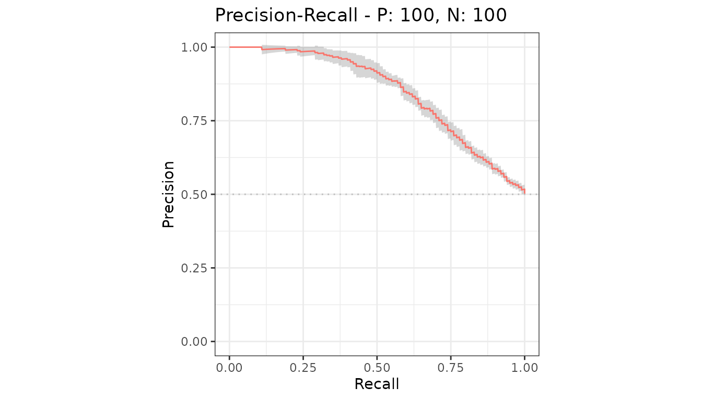
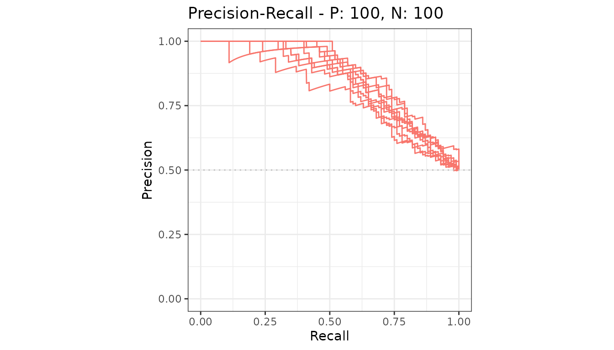
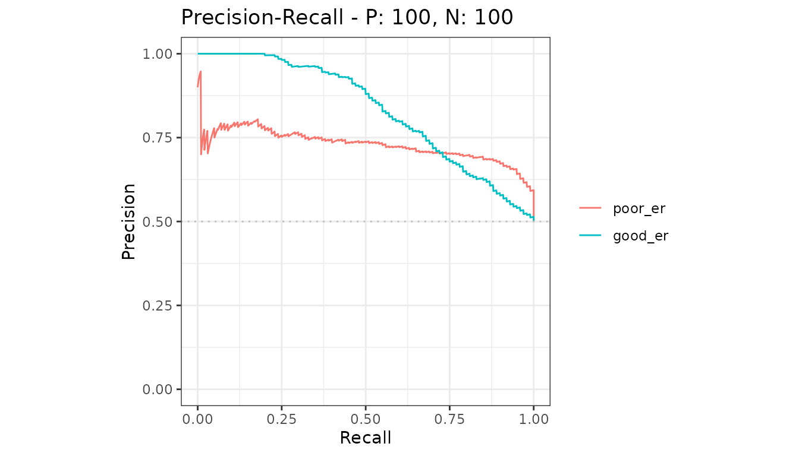

# Average over several test sets

One model tested on several datasets gives several curves. `precrec`
averages them and draws a confidence band around the average.

``` r

library(precrec)
library(ggplot2)

# 10 test sets for one model
samps <- create_sim_samples(10, 100, 100, "good_er")

mdat <- mmdata(samps[["scores"]], samps[["labels"]], dsids = samps[["dsids"]])
```

`dsids` is what marks these as several test sets rather than several
models.

## The average curve

``` r

curves <- evalmod(mdat)

autoplot(curves, "PRC")
```



The shaded band is the point-wise 95% confidence interval of the
average. It appears on its own as soon as a model has more than one test
set.

## The individual curves

Ask for them with `raw_curves = TRUE`.

``` r

raw <- evalmod(mdat, raw_curves = TRUE)

autoplot(raw, "PRC", show_cb = FALSE)
```



## Averaged areas

[`auc()`](https://evalclass.github.io/precrec/reference/auc.md) reports
the mean area over the test sets.

``` r

knitr::kable(auc(curves))
```

| modnames | dsids | curvetypes |      aucs |
|:---------|------:|:-----------|----------:|
| m1       |     1 | ROC        | 0.8180000 |
| m1       |     1 | PRC        | 0.8574152 |
| m1       |     2 | ROC        | 0.7865000 |
| m1       |     2 | PRC        | 0.8404735 |
| m1       |     3 | ROC        | 0.8313000 |
| m1       |     3 | PRC        | 0.8628264 |
| m1       |     4 | ROC        | 0.8244000 |
| m1       |     4 | PRC        | 0.8578336 |
| m1       |     5 | ROC        | 0.8204000 |
| m1       |     5 | PRC        | 0.8519919 |
| m1       |     6 | ROC        | 0.8285000 |
| m1       |     6 | PRC        | 0.8577692 |
| m1       |     7 | ROC        | 0.7925000 |
| m1       |     7 | PRC        | 0.8071713 |
| m1       |     8 | ROC        | 0.7832000 |
| m1       |     8 | PRC        | 0.8267456 |
| m1       |     9 | ROC        | 0.8343000 |
| m1       |     9 | PRC        | 0.8609178 |
| m1       |    10 | ROC        | 0.7943000 |
| m1       |    10 | PRC        | 0.8497775 |

[`auc_ci()`](https://evalclass.github.io/precrec/reference/auc_ci.md)
puts a confidence interval on it.

``` r

knitr::kable(auc_ci(curves))
```

| modnames | curvetypes |      mean |     error | lower_bound | upper_bound |   n |
|:---------|:-----------|----------:|----------:|------------:|------------:|----:|
| m1       | ROC        | 0.8113400 | 0.0123463 |   0.7989937 |   0.8236863 |  10 |
| m1       | PRC        | 0.8472922 | 0.0110427 |   0.8362495 |   0.8583350 |  10 |

## Both at once

Several models *and* several test sets is the same call with both
identifiers set. Each model gets one average curve.

``` r

samps2 <- create_sim_samples(10, 100, 100, c("poor_er", "good_er"))

mdat2 <- mmdata(samps2[["scores"]], samps2[["labels"]],
  modnames = samps2[["modnames"]], dsids = samps2[["dsids"]]
)

autoplot(evalmod(mdat2), "PRC")
```



## Next

- [Confidence
  bands](https://evalclass.github.io/precrec/articles/plots-confidence-bands.md) -
  how the band is built and how to change it
- [Evaluate cross-validation
  folds](https://evalclass.github.io/precrec/articles/howto-cross-validation.md)
