# Introduction to precrec

The `precrec` package provides accurate computations of ROC and
Precision-Recall curves.

## 1. Basic functions

The `evalmod` function calculates ROC and Precision-Recall curves and
returns an S3 object.

``` r

library(precrec)

# Load a test dataset
data(P10N10)

# Calculate ROC and Precision-Recall curves
sscurves <- evalmod(scores = P10N10$scores, labels = P10N10$labels)
```

### S3 generics

The R language specifies S3 objects and S3 generic functions as part of
the most basic object-oriented system in R. The `precrec` package
provides nine S3 generics for the S3 object created by the `evalmod`
function.

| S3 generic | Package | Description |
|:---|:---|:---|
| print | base | Print the calculation results and the summary of the test data |
| as.data.frame | base | Convert a precrec object to a data frame |
| plot | graphics | Plot performance evaluation measures |
| autoplot | ggplot2 | Plot performance evaluation measures with ggplot2 |
| fortify | ggplot2 | Prepare a data frame for ggplot2 |
| auc | precrec | Make a data frame with AUC scores |
| part | precrec | Set partial curves and calculate AUC scores |
| pauc | precrec | Make a data frame with pAUC scores |
| auc_ci | precrec | Calculate confidence intervals of AUC scores |

#### Example of the plot function

The `plot` function outputs ROC and Precision-Recall curves

``` r

# Show ROC and Precision-Recall plots
plot(sscurves)

# Show a Precision-Recall plot
plot(sscurves, "PRC")
```

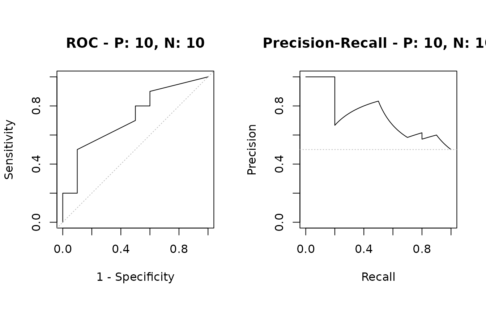

#### Example of the autoplot function

The `autoplot` function outputs ROC and Precision-Recall curves by using
the `ggplot2` package.

``` r

# The ggplot2 package is required
library(ggplot2)

# Show ROC and Precision-Recall plots
autoplot(sscurves)

# Show a Precision-Recall plot
autoplot(sscurves, "PRC")
```

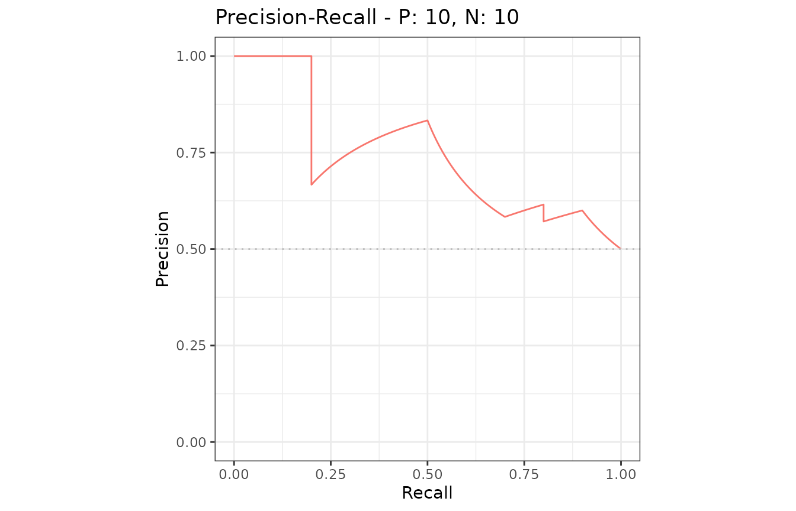

Reduced supporting points make the plotting speed faster for large data
sets.

``` r

# 5 data sets with 50000 positives and 50000 negatives
samp1 <- create_sim_samples(5, 50000, 50000)

# Calculate curves
eval1 <- evalmod(scores = samp1$scores, labels = samp1$labels)

# Reduced supporting points
system.time(autoplot(eval1))

# Full supporting points
system.time(autoplot(eval1, reduce_points = FALSE))
```

    ##    user  system elapsed 
    ##   0.088   0.000   0.089 
    ##    user  system elapsed 
    ##   0.413   0.018   0.431

#### Example of the auc function

The `auc` function outputs a data frame with the AUC (Area Under the
Curve) scores.

``` r

# Get a data frame with AUC scores
aucs <- auc(sscurves)

# Use knitr::kable to display the result in a table format
knitr::kable(aucs)
```

| modnames | dsids | curvetypes |      aucs |
|:---------|------:|:-----------|----------:|
| m1       |     1 | ROC        | 0.7200000 |
| m1       |     1 | PRC        | 0.7397716 |

``` r

# Get AUCs of Precision-Recall
aucs_prc <- subset(aucs, curvetypes == "PRC")
knitr::kable(aucs_prc)
```

|     | modnames | dsids | curvetypes |      aucs |
|:----|:---------|------:|:-----------|----------:|
| 2   | m1       |     1 | PRC        | 0.7397716 |

#### Example of the as.data.frame function

The `as.data.frame` function converts a precrec object to a data frame.

``` r

# Convert sscurves to a data frame
sscurves.df <- as.data.frame(sscurves)

# Use knitr::kable to display the result in a table format
knitr::kable(head(sscurves.df))
```

|     x |   y | modname | dsid | type |
|------:|----:|:--------|:-----|:-----|
| 0.000 | 0.0 | m1      | 1    | ROC  |
| 0.000 | 0.1 | m1      | 1    | ROC  |
| 0.000 | 0.2 | m1      | 1    | ROC  |
| 0.001 | 0.2 | m1      | 1    | ROC  |
| 0.002 | 0.2 | m1      | 1    | ROC  |
| 0.003 | 0.2 | m1      | 1    | ROC  |

## 2. Data preparation

The `precrec` package provides four functions for data preparation.

| Function | Description |
|:---|:---|
| join_scores | Join scores of multiple models into a list |
| join_labels | Join observed labels of multiple test datasets into a list |
| mmdata | Reformat input data for performance evaluation calculation |
| create_sim_samples | Create random samples for simulations |

### Example of the join_scores function

The `join_scores` function combines multiple score datasets.

``` r

s1 <- c(1, 2, 3, 4)
s2 <- c(5, 6, 7, 8)
s3 <- matrix(1:8, 4, 2)

# Join two score vectors
scores1 <- join_scores(s1, s2)

# Join two vectors and a matrix
scores2 <- join_scores(s1, s2, s3)
```

### Example of the join_labels function

The `join_labels` function combines multiple score datasets.

``` r

l1 <- c(1, 0, 1, 1)
l2 <- c(1, 0, 1, 1)
l3 <- c(1, 0, 1, 0)

# Join two label vectors
labels1 <- join_labels(l1, l2)
labels2 <- join_labels(l1, l3)
```

### Example of the mmdata function

The `mmdata` function makes an input dataset for the `evalmod` function.

``` r

# Create an input dataset with two score vectors and one label vector
msmdat <- mmdata(scores1, labels1)

# Specify dataset IDs
smmdat <- mmdata(scores1, labels2, dsids = c(1, 2))

# Specify model names and dataset IDs
mmmdat <- mmdata(scores1, labels2,
  modnames = c("mod1", "mod2"),
  dsids = c(1, 2)
)
```

### Example of the create_sim_samples function

The `create_sim_samples` function is useful to make a random sample
dataset with different performance levels.

| Level name | Description          |
|:-----------|:---------------------|
| random     | Random               |
| poor_er    | Poor early retrieval |
| good_er    | Good early retrieval |
| excel      | Excellent            |
| perf       | Perfect              |
| all        | All of the above     |

``` r

# A dataset with 10 positives and 10 negatives for the random performance level
samps1 <- create_sim_samples(1, 10, 10, "random")

#  A dataset for five different performance levels
samps2 <- create_sim_samples(1, 10, 10, "all")

# A dataset with 20 samples for the good early retrieval performance level
samps3 <- create_sim_samples(20, 10, 10, "good_er")

# A dataset with 20 samples for five different performance levels
samps4 <- create_sim_samples(20, 10, 10, "all")
```

## 3. Multiple models

The `evalmod` function calculate performance evaluation for multiple
models when multiple model names are specified with the `mmdata` or the
`evalmod` function.

### Data preparation

There are several ways to create a dataset with the `mmdata` function
for multiple models.

``` r

# Use a list with multiple score vectors and a list with a single label vector
msmdat1 <- mmdata(scores1, labels1)

# Explicitly specify model names
msmdat2 <- mmdata(scores1, labels1, modnames = c("mod1", "mod2"))

# Use a sample dataset created by the create_sim_samples function
msmdat3 <- mmdata(samps2[["scores"]], samps2[["labels"]],
  modnames = samps2[["modnames"]]
)
```

### ROC and Precision-Recall calculations

The `evalmod` function automatically detects multiple models.

``` r

# Calculate ROC and Precision-Recall curves for multiple models
mscurves <- evalmod(msmdat3)
```

### S3 generics

All the S3 generics are effective for the S3 object generated by this
approach.

``` r

# Show ROC and Precision-Recall curves with the ggplot2 package
autoplot(mscurves)
```

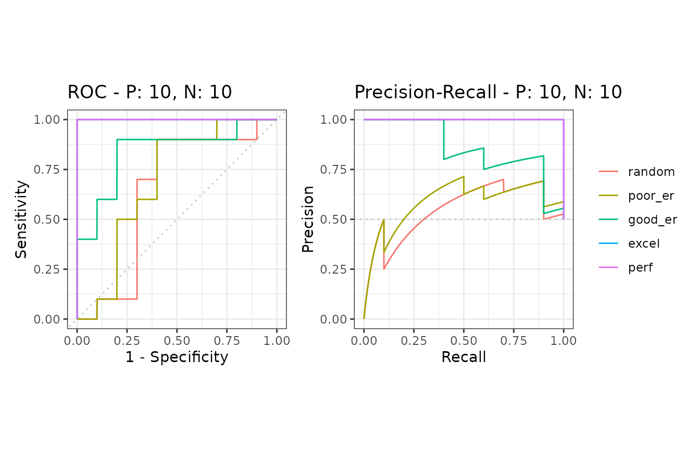

#### Example of the as.data.frame function

The `as.data.frame` function also works with this object.

``` r

# Convert mscurves to a data frame
mscurves.df <- as.data.frame(mscurves)

# Use knitr::kable to display the result in a table format
knitr::kable(head(mscurves.df))
```

|     x |   y | modname | dsid | type |
|------:|----:|:--------|:-----|:-----|
| 0.000 |   0 | random  | 1    | ROC  |
| 0.001 |   0 | random  | 1    | ROC  |
| 0.002 |   0 | random  | 1    | ROC  |
| 0.003 |   0 | random  | 1    | ROC  |
| 0.004 |   0 | random  | 1    | ROC  |
| 0.005 |   0 | random  | 1    | ROC  |

## 4. Multiple test sets

The `evalmod` function calculate performance evaluation for multiple
test datasets when different test dataset IDs are specified with the
`mmdata` or the `evalmod` function.

### Data preparation

There are several ways to create a dataset with the `mmdata` function
for multiple test datasets.

``` r

# Specify test dataset IDs names
smmdat1 <- mmdata(scores1, labels2, dsids = c(1, 2))

# Use a sample dataset created by the create_sim_samples function
smmdat2 <- mmdata(samps3[["scores"]], samps3[["labels"]],
  dsids = samps3[["dsids"]]
)
```

### ROC and Precision-Recall calculations

The `evalmod` function automatically detects multiple test datasets.

``` r

# Calculate curves for multiple test datasets and keep all the curves
smcurves <- evalmod(smmdat2, raw_curves = TRUE)
```

### S3 generics

All the S3 generics are effective for the S3 object generated by this
approach.

``` r

# Show an average Precision-Recall curve with the 95% confidence bounds
autoplot(smcurves, "PRC", show_cb = TRUE)

# Show raw Precision-Recall curves
autoplot(smcurves, "PRC", show_cb = FALSE)
```

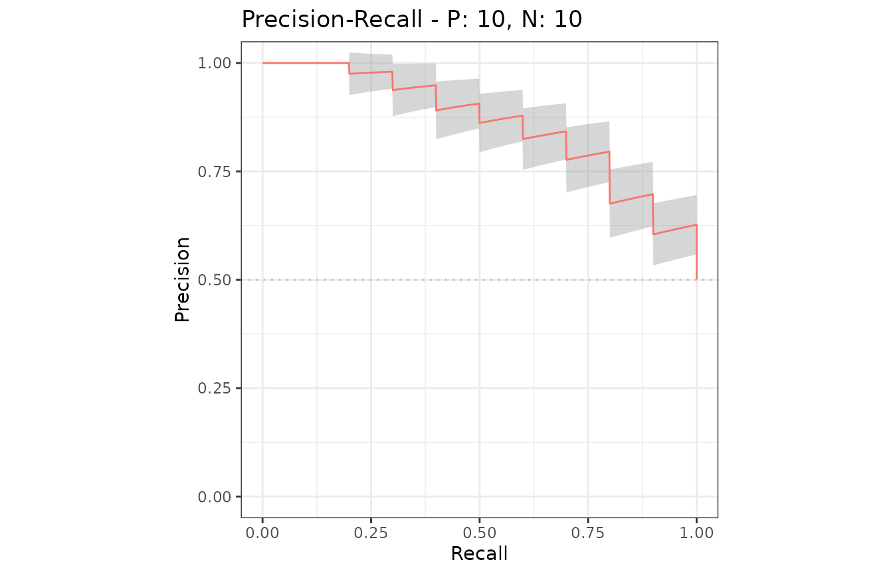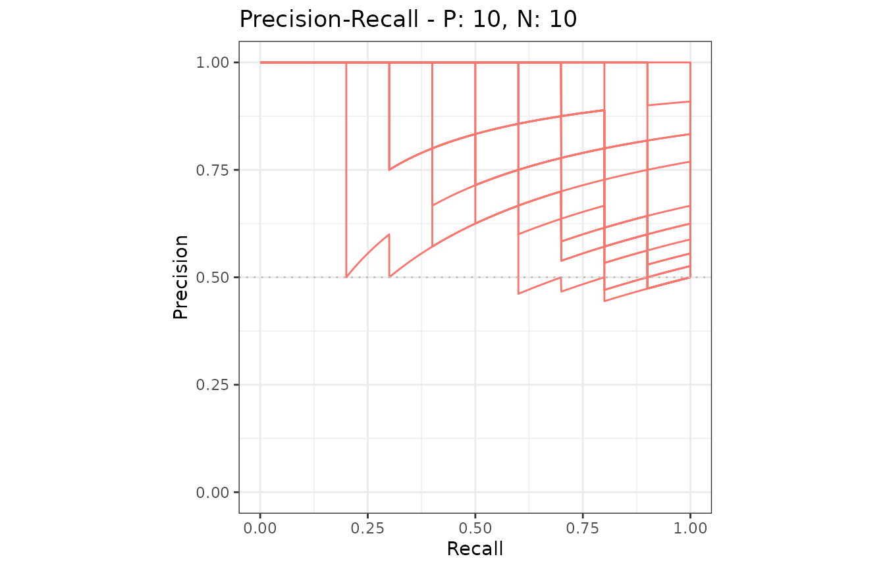

#### Example of the as.data.frame function

The `as.data.frame` function also works with this object.

``` r

# Convert smcurves to a data frame
smcurves.df <- as.data.frame(smcurves)

# Use knitr::kable to display the result in a table format
knitr::kable(head(smcurves.df))
```

|   x |   y | modname | dsid | type |
|----:|----:|:--------|:-----|:-----|
|   0 | 0.0 | m1      | 1    | ROC  |
|   0 | 0.1 | m1      | 1    | ROC  |
|   0 | 0.2 | m1      | 1    | ROC  |
|   0 | 0.3 | m1      | 1    | ROC  |
|   0 | 0.4 | m1      | 1    | ROC  |
|   0 | 0.5 | m1      | 1    | ROC  |

## 5. Multiple models and multiple test sets

The `evalmod` function calculates performance evaluation for multiple
models and multiple test datasets when different model names and test
dataset IDs are specified with the `mmdata` or the `evalmod` function.

### Data preparation

There are several ways to create a dataset with the `mmdata` function
for multiple models and multiple datasets.

``` r

# Specify model names and test dataset IDs names
mmmdat1 <- mmdata(scores1, labels2,
  modnames = c("mod1", "mod2"),
  dsids = c(1, 2)
)

# Use a sample dataset created by the create_sim_samples function
mmmdat2 <- mmdata(samps4[["scores"]], samps4[["labels"]],
  modnames = samps4[["modnames"]], dsids = samps4[["dsids"]]
)
```

### ROC and Precision-Recall calculations

The `evalmod` function automatically detects multiple models and
multiple test datasets.

``` r

# Calculate curves for multiple models and multiple test datasets
mmcurves <- evalmod(mmmdat2)
```

### S3 generics

All the S3 generics are effective for the S3 object generated by this
approach.

``` r

# Show average Precision-Recall curves
autoplot(mmcurves, "PRC")

# Show average Precision-Recall curves with the 95% confidence bounds
autoplot(mmcurves, "PRC", show_cb = TRUE)
```

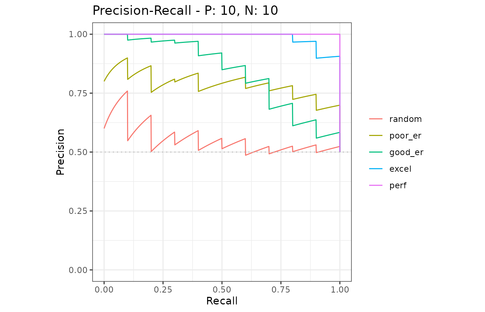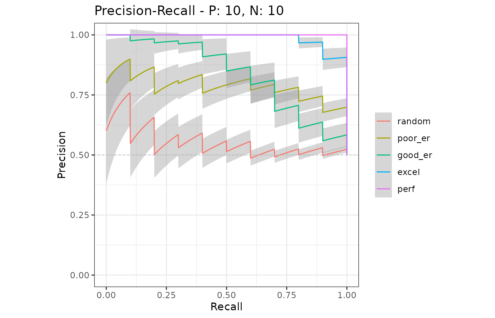

#### Example of the as.data.frame function

The `as.data.frame` function also works with this object.

``` r

# Convert smcurves to a data frame
mmcurves.df <- as.data.frame(mmcurves)

# Use knitr::kable to display the result in a table format
knitr::kable(head(mmcurves.df))
```

|     x |    y |      ymin |      ymax | modname | type |
|------:|-----:|----------:|----------:|:--------|:-----|
| 0.000 | 0.00 | 0.0000000 | 0.0000000 | random  | ROC  |
| 0.000 | 0.11 | 0.0551136 | 0.1648864 | random  | ROC  |
| 0.001 | 0.11 | 0.0551136 | 0.1648864 | random  | ROC  |
| 0.002 | 0.11 | 0.0551136 | 0.1648864 | random  | ROC  |
| 0.003 | 0.11 | 0.0551136 | 0.1648864 | random  | ROC  |
| 0.004 | 0.11 | 0.0551136 | 0.1648864 | random  | ROC  |

## 6. Confidence interval bands

The `evalmod` function automatically calculates confidence bands when a
model contains multiple test sets in provided dataset. Confidence
intervals are calculated for additional supporting points, which are
specified by the ‘x_bins’ option of the `evalmod` function.

### Example of confidence bands when x_bins is 2

The dataset `smmdat2` contains 20 samples for a single model/classifier.

``` r

# Show all curves
smcurves_all <- evalmod(smmdat2, raw_curves = TRUE)
autoplot(smcurves_all)
```

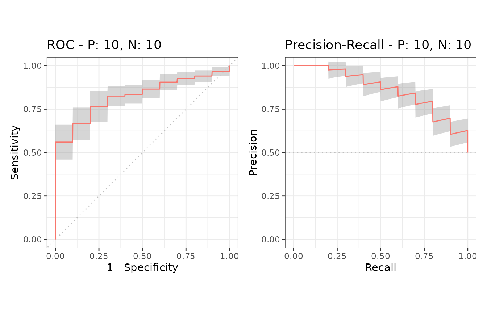

Additional supporting points are calculated for `x = (0, 0.5, 1.0)` when
`x_bins` is set to 2.

``` r

# x_bins: 2
smcurves_xb2 <- evalmod(smmdat2, x_bins = 2)
autoplot(smcurves_xb2)
```

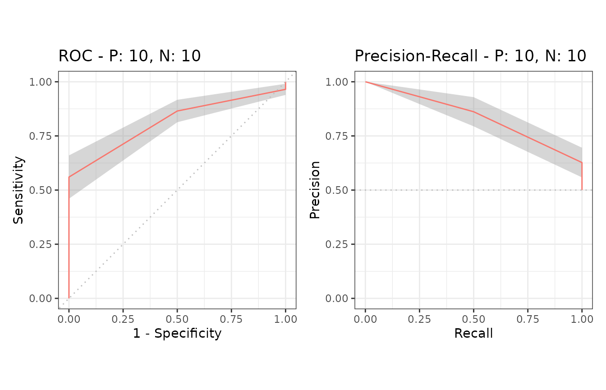

### Example of confidence bands when x_bins is 10

Additional supporting points are calculated for
`x = (0, 0.1, 0.2, 0.3, 0.4, 0.5, 0.6, 0.7, 0.8, 0.9, 1.0)` when
`x_bins` is set to 10.

``` r

# x_bins: 10
smcurves_xb10 <- evalmod(smmdat2, x_bins = 10)
autoplot(smcurves_xb10)
```

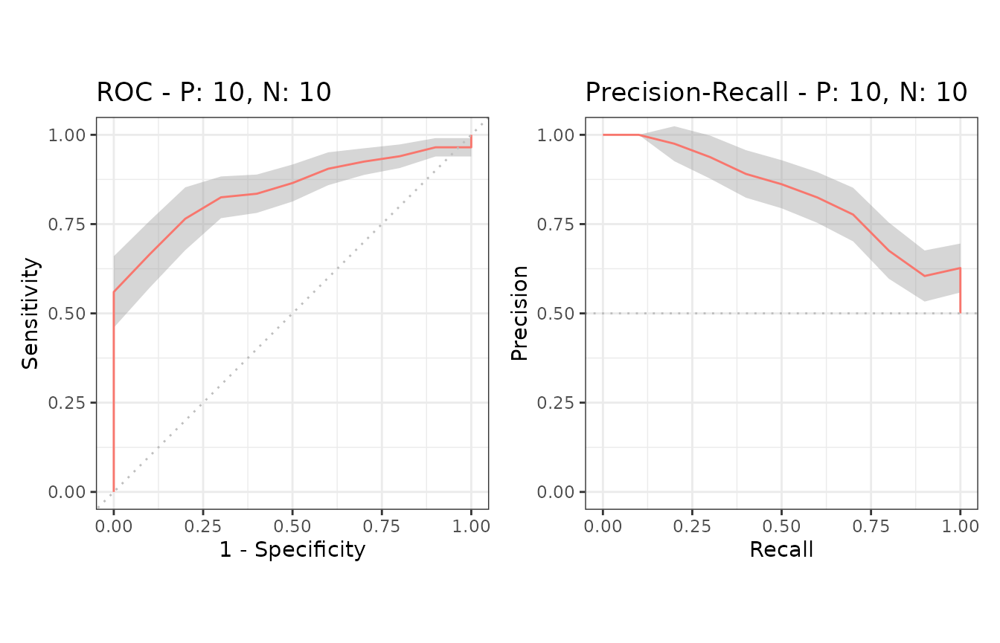

### Example of the alpha value

The `evalmod` function accepts the `cb_alpha` option to specify the
alpha value of the point-wise confidence bounds calculation. For
instance, 95% confidence bands are calculated when `cb_alpha` is 0.05.

``` r

# cb_alpha: 0.1 for 90% confidence band
smcurves_cb1 <- evalmod(smmdat2, x_bins = 10, cb_alpha = 0.1)
autoplot(smcurves_cb1)

# cb_alpha: 0.01 for 99% confidence band
smcurves_cb2 <- evalmod(smmdat2, x_bins = 10, cb_alpha = 0.01)
autoplot(smcurves_cb2)
```

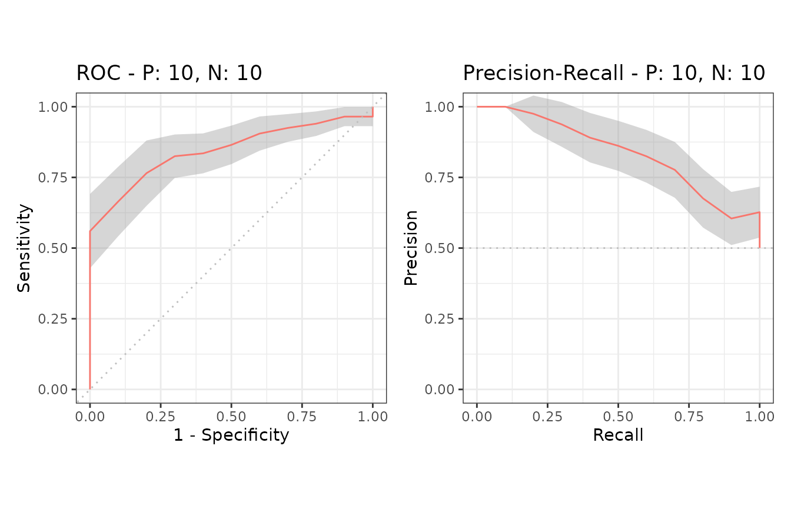

## 7. Cross validation

The `format_nfold` function takes a data frame with scores, label and
n-fold columns and convert it to a list for `evalmod` and `mmdata`.

#### Example of a data frame with 5-fold data

``` r

# Load data
data(M2N50F5)

# Use knitr::kable to display the result in a table format
knitr::kable(head(M2N50F5))
```

|     score1 |     score2 | label | fold |
|-----------:|-----------:|:------|-----:|
|  2.0606025 |  1.0689227 | pos   |    1 |
|  0.3066092 |  0.1745491 | pos   |    3 |
|  1.5597733 | -1.5666375 | pos   |    1 |
| -0.6044989 |  1.1572727 | pos   |    3 |
| -0.2229031 |  0.6070042 | pos   |    5 |
| -0.7679551 | -1.7908147 | pos   |    5 |

#### Example of the format_nfold function with 5-fold datasets

``` r

# Convert data frame to list
nfold_list1 <- format_nfold(
  nfold_df = M2N50F5, score_cols = c(1, 2),
  lab_col = 3, fold_col = 4
)

# Use column names
nfold_list2 <- format_nfold(
  nfold_df = M2N50F5,
  score_cols = c("score1", "score2"),
  lab_col = "label", fold_col = "fold"
)

# Use the result for evalmod
cvcurves <- evalmod(
  scores = nfold_list2$scores, labels = nfold_list2$labels,
  modnames = rep(c("m1", "m2"), each = 5),
  dsids = rep(1:5, 2)
)
autoplot(cvcurves)
```

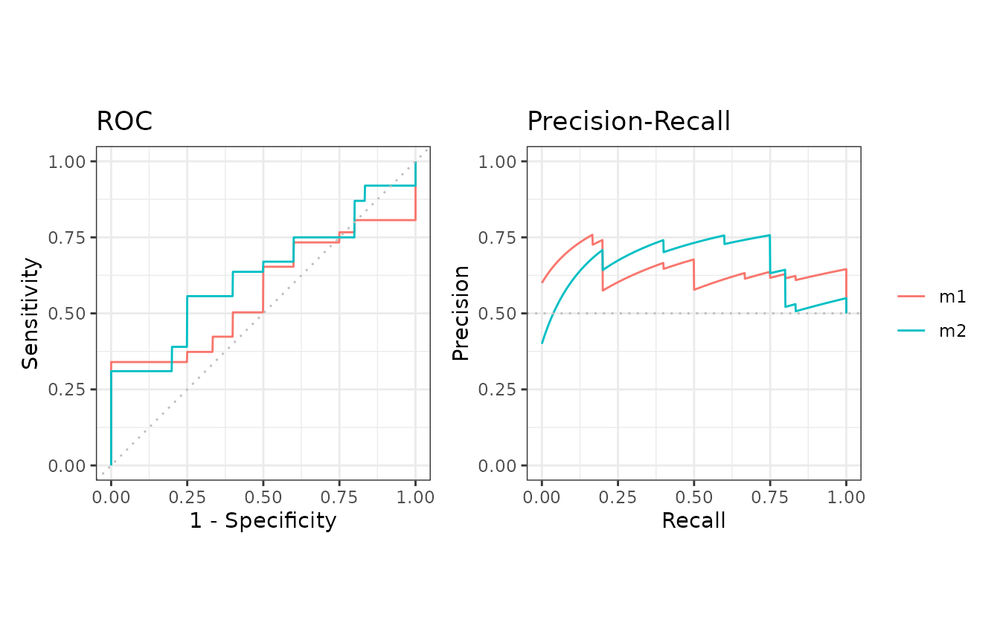

### evalmod and mmdata with cross validation datasets

Both `evalmod` and `mmdata` function can directly take the arguments of
the `format_nfold` function.

#### Example of evalmod and mmdata with 5-fold data

``` r

# mmdata
cvcurves2 <- mmdata(
  nfold_df = M2N50F5, score_cols = c(1, 2),
  lab_col = 3, fold_col = 4,
  modnames = c("m1", "m2"), dsids = 1:5
)

# evalmod
cvcurves3 <- evalmod(
  nfold_df = M2N50F5, score_cols = c(1, 2),
  lab_col = 3, fold_col = 4,
  modnames = c("m1", "m2"), dsids = 1:5
)
autoplot(cvcurves3)
```


## 8. Basic performance measures

The `evalmod` function also calculates basic evaluation measures -
error, accuracy, specificity, sensitivity, and precision.

| Measure           | Description                      |
|:------------------|:---------------------------------|
| error             | Error rate                       |
| accuracy          | Accuracy                         |
| specificity       | Specificity, TNR, 1 - FPR        |
| sensitivity       | Sensitivity, TPR, Recall         |
| precision         | Precision, PPV                   |
| mcc               | Matthews correlation coefficient |
| fscore            | F-score, F-beta with `beta`      |
| balanced_accuracy | Balanced accuracy                |
| npv               | Negative predictive value        |
| informedness      | Informedness, Youden’s J         |
| markedness        | Markedness                       |
| kappa             | Cohen’s kappa                    |

### Basic measure calculations

The `mode = "basic"` option makes the `evalmod` function calculate the
basic evaluation measures instead of performing ROC and Precision-Recall
calculations.

``` r

# Calculate basic evaluation measures
mmpoins <- evalmod(mmmdat2, mode = "basic")
```

### S3 generics

All the S3 generics except for `auc`, `part` and `pauc` are effective
for the S3 object generated by this approach.

``` r

# Show normalized ranks vs. error rate and accuracy
autoplot(mmpoins, c("error", "accuracy"))

# Show normalized ranks vs. specificity, sensitivity, and precision
autoplot(mmpoins, c("specificity", "sensitivity", "precision"))

# Show normalized ranks vs. Matthews correlation coefficient and F-score
autoplot(mmpoins, c("mcc", "fscore"))

# Show normalized ranks vs. balanced accuracy, informedness, and kappa
autoplot(mmpoins, c("balanced_accuracy", "informedness", "kappa"))
```

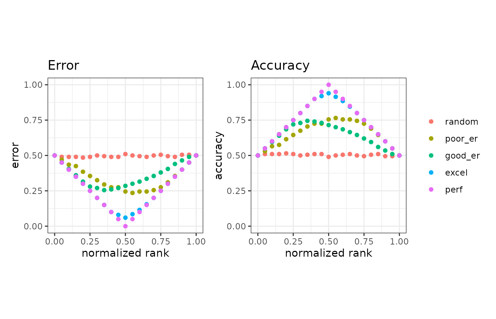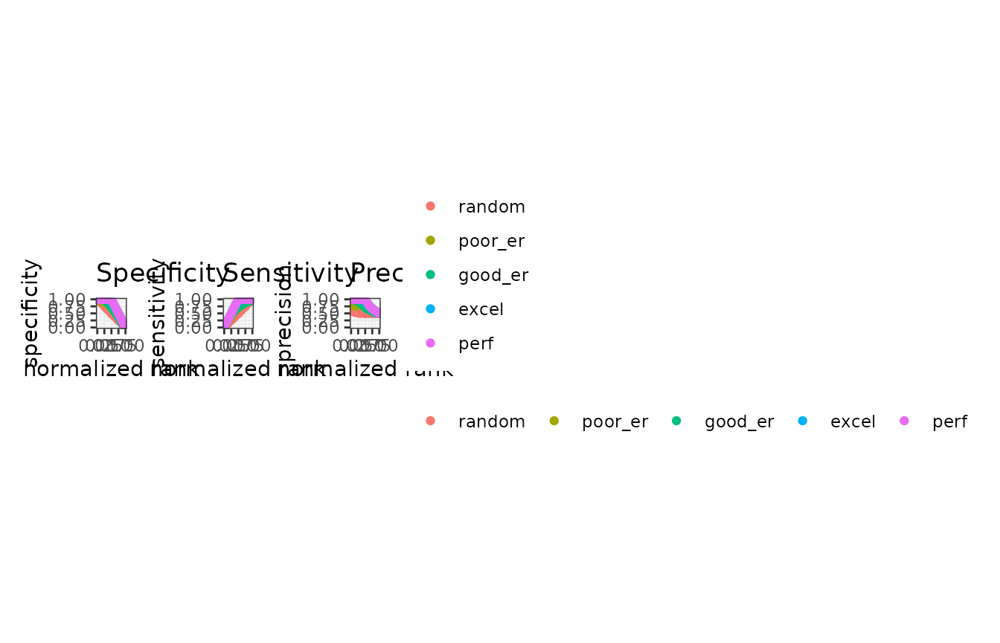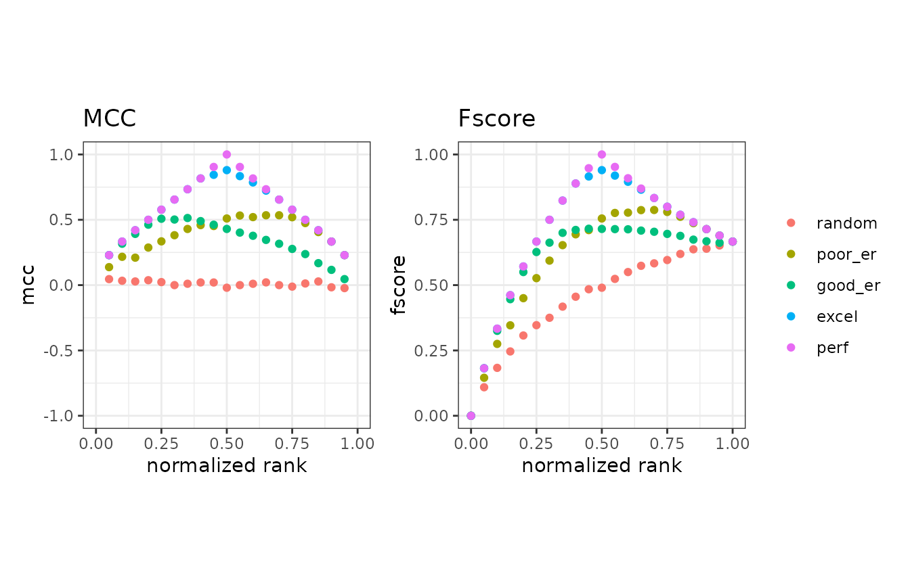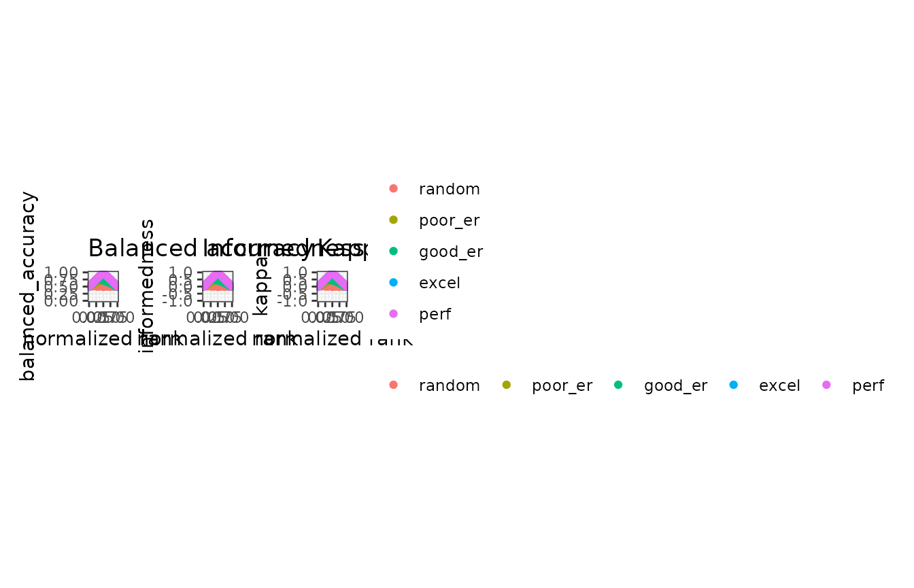

The `fscore` measure is the F-beta score. It defaults to the F1 score,
and the `beta` argument weights recall more or less heavily than
precision.

``` r

# F2 weights recall twice as heavily as precision
mmpoins.f2 <- evalmod(mmmdat2, mode = "basic", beta = 2)
```

### Additional measures

Eleven more measures are available on request. They are the ones `ROCR`
provides that `precrec` did not, and they are left out of the default
set because each is another vector the size of the dataset and another
panel in the default plot.

| Measure | Alternative names | Description |
|:---|:---|:---|
| fpr | fall | False positive rate, FP/N |
| fnr | miss | False negative rate, FN/P |
| false_discovery_rate | fdr, pcfall | False discovery rate |
| false_omission_rate | for, pcmiss | False omission rate |
| predicted_positive_rate | ppr, rpp | Rate of positive predictions |
| predicted_negative_rate | pnr, rnp | Rate of negative predictions |
| lift |  | Sensitivity over ppr |
| odds | odds_ratio | Odds ratio, TP*TN/(FN*FP) |
| mi | mutual_information | Mutual information, in bits |
| chisq |  | Pearson chi-square of the table |
| cost |  | Weighted misclassification cost |
| sar |  | Mean of accuracy, AUC and 1-RMSE |

The `metrics` argument names the ones to add, or `"all"` for every
measure. The default set is always kept, so nothing that worked before
stops working.

``` r

# Add the false positive rate and the lift to the default measures
mmpoins.extra <- evalmod(mmmdat2, mode = "basic", metrics = c("fpr", "lift"))

# Show normalized ranks vs. false positive rate and lift
autoplot(mmpoins.extra, c("fpr", "lift"))
```

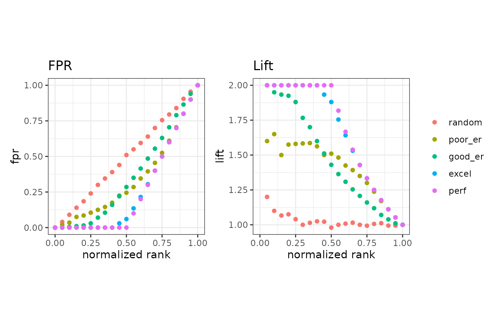

The `cost` measure weights the two kinds of error separately. It is not
normalized, following `ROCR`: it is
`cost_fp * FP / n + cost_fn * FN / n`, so with the default weights of 1
it is the error rate.

``` r

# A false positive costs six times what a false negative costs
mmpoins.cost <- evalmod(mmmdat2,
  mode = "basic", metrics = "cost",
  cost_fp = 3, cost_fn = 0.5
)
autoplot(mmpoins.cost, "cost")
```

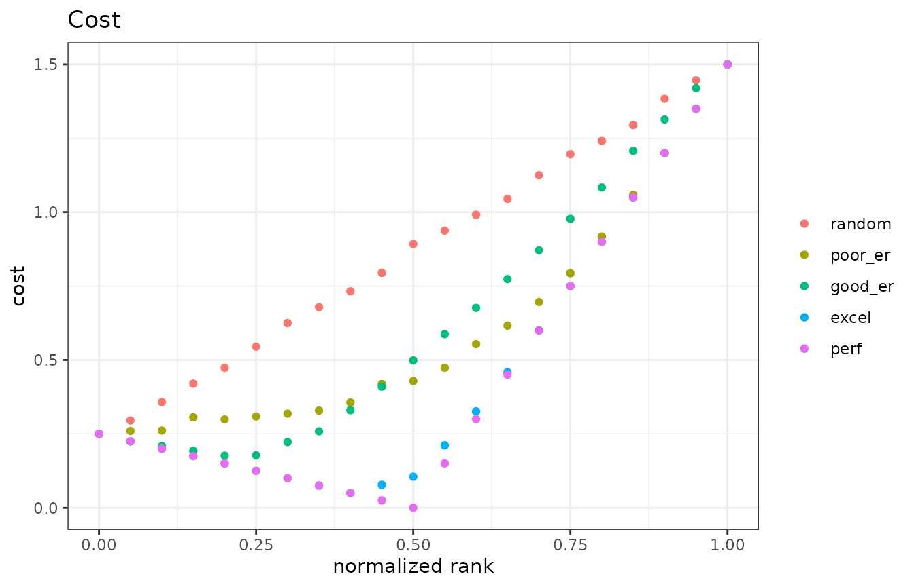

Three of these are undefined somewhere, and `precrec` says so
differently from `ROCR` in two of the three cases:

- The odds ratio and the chi-square statistic are `NA` at the top and
  the bottom of every dataset, where the 2x2 table has an empty cell.
  `ROCR` reports an infinity or a `NaN` there; `precrec` reports `NA`,
  as it already does for the undefined end of precision and of the
  negative predictive value.
- The mutual information is `0` at those two points rather than `NA`. A
  cutoff that predicts one class for everything carries no information
  about the labels, so that value is defined and it is zero.

The `sar` measure averages accuracy, the AUC of the ROC curve, and one
minus the root mean squared error. The last of those reads the values of
the scores rather than their ranks, so `sar` warns and returns `NA` when
the scores are not probabilities between 0 and 1. Every other measure
asked for in the same call is still returned.

#### Normalized ranks and predicted scores

In addition to the basic measures, the `autoplot` function can plot
normalized ranks vs. scores and labels.

``` r

# Show normalized ranks vs. scores and labels
autoplot(mmpoins, c("score", "label"))
```

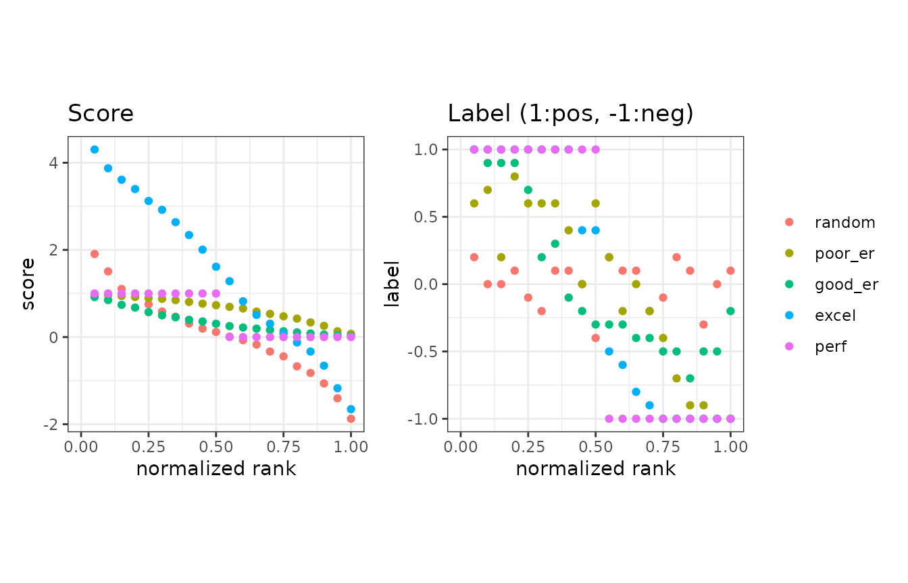

#### Example of the as.data.frame function

The `as.data.frame` function also works for the precrec objects of the
basic measures.

``` r

# Convert mmpoins to a data frame
mmpoins.df <- as.data.frame(mmpoins)

# Use knitr::kable to display the result in a table format
knitr::kable(head(mmpoins.df))
```

|    x |         y |      ymin |      ymax | modname | type  |
|-----:|----------:|----------:|----------:|:--------|:------|
| 0.00 |        NA |        NA |        NA | random  | score |
| 0.05 | 1.9070654 | 1.7380924 | 2.0760385 | random  | score |
| 0.10 | 1.5066177 | 1.3351867 | 1.6780487 | random  | score |
| 0.15 | 1.1050874 | 0.9964915 | 1.2136833 | random  | score |
| 0.20 | 0.9248578 | 0.8297744 | 1.0199411 | random  | score |
| 0.25 | 0.7523308 | 0.6490989 | 0.8555627 | random  | score |

## 9. Partial AUCs

The `part` function calculates partial AUCs and standardized partial
AUCs of both ROC and precision-recall curves. Standardized pAUCs
(spAUCs) are standardized to the score range between 0 and 1.

### partial AUC calculations

It requires an S3 object produced by the `evalmod` function and uses
`xlim` and `ylim` to specify the partial area of your choice. The `pauc`
function outputs a data frame with the pAUC scores.

``` r

# Calculate ROC and Precision-Recall curves
curves <- evalmod(scores = P10N10$scores, labels = P10N10$labels)

# Calculate partial AUCs
curves.part <- part(curves, xlim = c(0.0, 0.25))

# Retrieve a dataframe of pAUCs
paucs.df <- pauc(curves.part)

# Use knitr::kable to display the result in a table format
knitr::kable(paucs.df)
```

| modnames | dsids | curvetypes |     paucs |    spaucs |
|:---------|------:|:-----------|----------:|----------:|
| m1       |     1 | ROC        | 0.1006250 | 0.4025000 |
| m1       |     1 | PRC        | 0.2345849 | 0.9383396 |

### S3 generics

All the S3 generics are effective for the S3 object generated by this
approach.

``` r

# Show ROC and Precision-Recall curves
autoplot(curves.part)
```

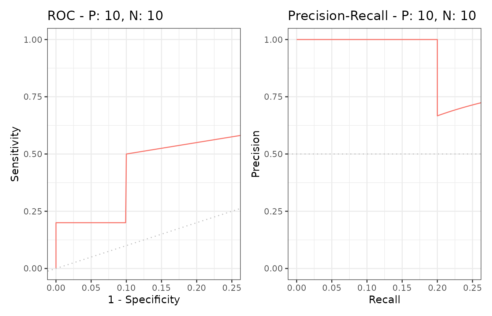

## 10. Fast AUC (ROC) calculation

The area under the ROC curve can be calculated from the U statistic,
which is the test statistic of the Mann–Whitney U test.

### AUC calculation with the U statistic

The `evalmod` function calculates AUCs with the U statistic when mode =
‘aucroc’.

``` r

# Calculate AUC (ROC)
aucs <- evalmod(scores = P10N10$scores, labels = P10N10$labels, mode = "aucroc")

# Convert to data.frame
aucs.df <- as.data.frame(aucs)

# Use knitr::kable to display the result in a table format
knitr::kable(aucs.df)
```

| modnames | dsids | aucs | ustats |
|:---------|:------|-----:|-------:|
| m1       | 1     | 0.72 |     72 |

## 11. Confidence intervals of AUCs

The `auc_ci` function calculates confidence intervals of the calculated
ROCs by the `evalmod` function.

### Default CI calculation with normal distribution and alpha=0.05

The `auc_ci` function calculates CIs for both ROC and precision-recall
AUCs. The specified data must contain multiple datasets, such as
cross-validation data.

``` r

# Calculate CI of AUCs with normal distibution
auc_ci <- auc_ci(smcurves)

# Use knitr::kable to display the result in a table format
knitr::kable(auc_ci)
```

| modnames | curvetypes |      mean |     error | lower_bound | upper_bound |   n |
|:---------|:-----------|----------:|----------:|------------:|------------:|----:|
| m1       | ROC        | 0.8250000 | 0.0503423 |   0.7746577 |   0.8753423 |  20 |
| m1       | PRC        | 0.8613514 | 0.0405382 |   0.8208132 |   0.9018896 |  20 |

### CI calculation with a different alpha (0.01)

The `auc_ci` function accepts a different significance level.

``` r

# Calculate CI of AUCs with alpha = 0.01
auc_ci_a <- auc_ci(smcurves, alpha = 0.01)

# Use knitr::kable to display the result in a table format
knitr::kable(auc_ci_a)
```

| modnames | curvetypes |      mean |     error | lower_bound | upper_bound |   n |
|:---------|:-----------|----------:|----------:|------------:|------------:|----:|
| m1       | ROC        | 0.8250000 | 0.0661611 |   0.7588389 |   0.8911611 |  20 |
| m1       | PRC        | 0.8613514 | 0.0532762 |   0.8080752 |   0.9146276 |  20 |

### CI calculation with t-distribution

The `auc_ci` function accepts either normal or t-distribution for CI
calculation.

``` r

# Calculate CI of AUCs t-distribution
auc_ci_t <- auc_ci(smcurves, dtype = "t")

# Use knitr::kable to display the result in a table format
knitr::kable(auc_ci_t)
```

| modnames | curvetypes |      mean |     error | lower_bound | upper_bound |   n |
|:---------|:-----------|----------:|----------:|------------:|------------:|----:|
| m1       | ROC        | 0.8250000 | 0.0537600 |   0.7712400 |   0.8787600 |  20 |
| m1       | PRC        | 0.8613514 | 0.0432903 |   0.8180611 |   0.9046417 |  20 |

## 12. Balanced and imbalanced datasets

It is easy to simulate various scenarios, such as balanced
vs. imbalanced datasets, by using the `evalmod` and `create_sim_samples`
functions.

### Data preparation

``` r

# Balanced dataset
samps5 <- create_sim_samples(100, 100, 100, "all")
simmdat1 <- mmdata(samps5[["scores"]], samps5[["labels"]],
  modnames = samps5[["modnames"]], dsids = samps5[["dsids"]]
)

# Imbalanced dataset
samps6 <- create_sim_samples(100, 25, 100, "all")
simmdat2 <- mmdata(samps6[["scores"]], samps6[["labels"]],
  modnames = samps6[["modnames"]], dsids = samps6[["dsids"]]
)
```

### ROC and Precision-Recall calculations

The `evalmod` function automatically detects multiple models and
multiple test datasets.

``` r

# Balanced dataset
simcurves1 <- evalmod(simmdat1)

# Imbalanced dataset
simcurves2 <- evalmod(simmdat2)
```

### Balanced vs. imbalanced datasets

ROC plots are unchanged between balanced and imbalanced datasets,
whereas Precision-Recall plots show a clear difference between them. See
our [article](https://doi.org/10.1371/journal.pone.0118432) or
[website](https://classeval.wordpress.com) for potential pitfalls by
using ROC plots with imbalanced datasets.

``` r

# Balanced dataset
autoplot(simcurves1)

# Imbalanced dataset
autoplot(simcurves2)
```

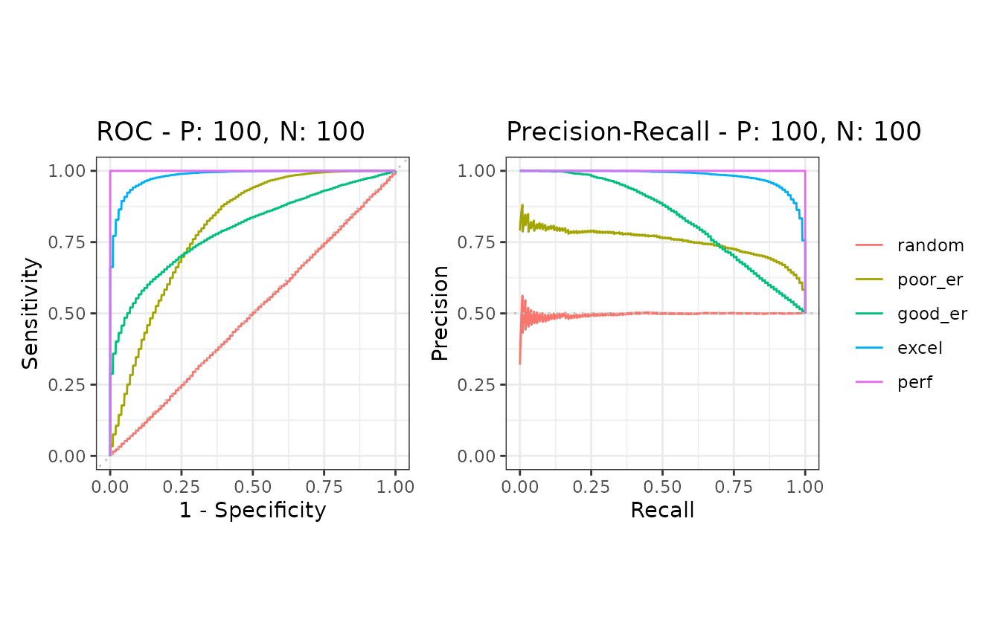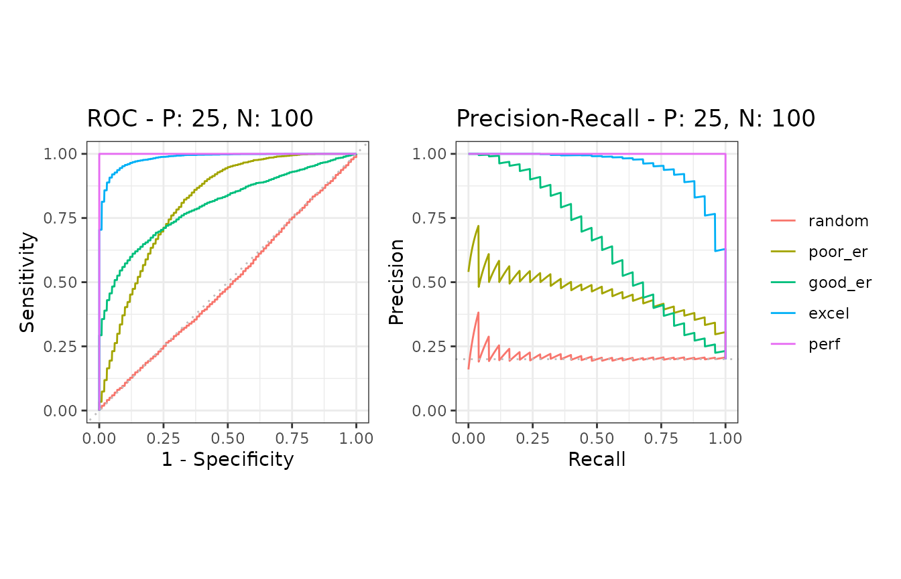

## 13. Probability-based metrics

The Brier score, its square root the root mean squared error, and the
log loss measure how close predicted probabilities are to the observed
labels. Unlike ROC and precision-recall curves, they read the values of
the scores rather than their ranks, so the scores must be probabilities
between 0 and 1.

### Brier score, RMSE and log loss

The `prob_metrics` function takes the same input as `evalmod` and
returns a data frame with one row per model, dataset, and metric.

``` r

# The "poor_er" and "good_er" samples are drawn from beta distributions
psamps <- create_sim_samples(4, 100, 100, c("poor_er", "good_er"))
pmdat <- mmdata(psamps[["scores"]], psamps[["labels"]],
  modnames = psamps[["modnames"]], dsids = psamps[["dsids"]]
)

# Calculate the Brier score, the RMSE and the log loss
pmetrics.df <- prob_metrics(pmdat)

# Use knitr::kable to display the result in a table format
knitr::kable(head(pmetrics.df))
```

| modnames | dsids | metrics |    values |
|:---------|------:|:--------|----------:|
| poor_er  |     1 | brier   | 0.1817074 |
| poor_er  |     1 | rmse    | 0.4262715 |
| poor_er  |     1 | logloss | 0.5497794 |
| good_er  |     1 | brier   | 0.2113615 |
| good_er  |     1 | rmse    | 0.4597407 |
| good_er  |     1 | logloss | 0.6625846 |

### Confidence intervals

The `prob_metrics_ci` function summarizes those per-dataset values into
a confidence interval for each model and metric.

``` r

# Calculate the confidence intervals
pmetrics.ci <- prob_metrics_ci(pmdat)

# Use knitr::kable to display the result in a table format
knitr::kable(pmetrics.ci)
```

| modnames | metrics |      mean |     error | lower_bound | upper_bound |   n |
|:---------|:--------|----------:|----------:|------------:|------------:|----:|
| poor_er  | brier   | 0.1964916 | 0.0187863 |   0.1777053 |   0.2152778 |   4 |
| poor_er  | rmse    | 0.4428790 | 0.0211638 |   0.4217152 |   0.4640427 |   4 |
| poor_er  | logloss | 0.6067743 | 0.0742464 |   0.5325279 |   0.6810207 |   4 |
| good_er  | brier   | 0.2083717 | 0.0089505 |   0.1994211 |   0.2173222 |   4 |
| good_er  | rmse    | 0.4563949 | 0.0098222 |   0.4465727 |   0.4662171 |   4 |
| good_er  | logloss | 0.6431311 | 0.0243167 |   0.6188144 |   0.6674478 |   4 |

## 14. Precision-recall break-even point

The break-even point of a precision-recall curve is where precision and
recall are equal. The `prbe` function finds it, and returns a data frame
with one row per break-even point in the manner of `auc`.

``` r

prsamps <- create_sim_samples(2, 100, 100, c("poor_er", "good_er"))
prmdat <- mmdata(prsamps[["scores"]], prsamps[["labels"]],
  modnames = prsamps[["modnames"]], dsids = prsamps[["dsids"]]
)
prcurves <- evalmod(prmdat, raw_curves = TRUE)

# Use knitr::kable to display the result in a table format
knitr::kable(prbe(prcurves))
```

| modnames | dsids | prbe |
|:---------|------:|-----:|
| poor_er  |     1 | 0.00 |
| poor_er  |     1 | 0.70 |
| poor_er  |     1 | 0.70 |
| good_er  |     1 | 0.75 |
| poor_er  |     2 | 0.72 |
| good_er  |     2 | 0.69 |

A curve can cross the diagonal more than once, and then the data frame
holds one row per crossing. A curve that never reaches equal precision
and recall gets a single row of `NA`.

`ROCR::performance(pred, "prbe")` interpolates linearly between adjacent
raw precision-recall points to find the crossing. Linear interpolation
between precision-recall points is not correct, which is the reason this
package exists, so `prbe` reads the crossing off the curve `evalmod` has
already interpolated properly.

## 15. One measure against another

The `metric_curve` function takes the name of a measure for the x axis
and the name of a measure for the y axis and draws one against the
other, in the manner of `ROCR::performance`. Every measure `evalmod` can
calculate is available on both axes, under its own name or under the
identifier `ROCR` uses for it.

``` r

xysamps <- create_sim_samples(1, 100, 100, "good_er")

# The default pair is ROCR's most common call
xy1 <- metric_curve(
  scores = xysamps[["scores"]], labels = xysamps[["labels"]],
  x_metric = "fpr", y_metric = "sensitivity"
)
autoplot(xy1)
```

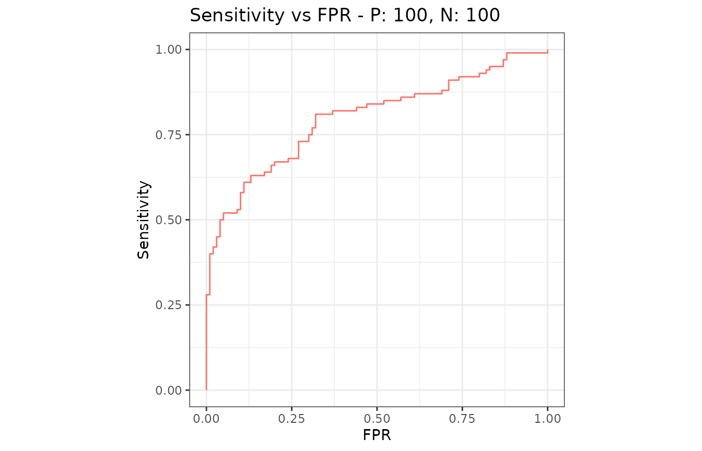

### Which pairs are joined by a line

`precrec` exists because the points of a precision-recall curve must not
be joined by straight lines. The measures this function reads are raw
per-cutoff values with no interpolation, so joining an arbitrary pair of
them would be the very error the package was written to avoid.

Two pairs have a defined interpolation, and only those two are drawn as
curves: false positive rate against sensitivity, which is the ROC curve,
and sensitivity against precision, which is the precision-recall curve.
For those two, `metric_curve` hands the work to the same code
`evalmod(mode = "rocprc")` uses, so the two cannot disagree.

Every other pair is drawn as points.

``` r

# No interpolation is defined between these two, so they are drawn as points
xy2 <- metric_curve(
  scores = xysamps[["scores"]], labels = xysamps[["labels"]],
  x_metric = "predicted_positive_rate", y_metric = "lift"
)
autoplot(xy2)
```

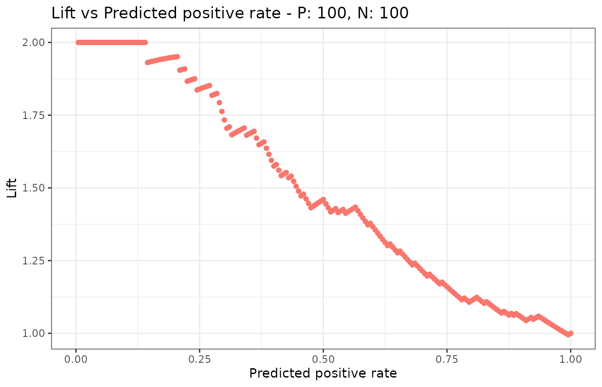

Pass `type = "l"` to `plot` or `autoplot` to join them anyway, having
decided that the straight lines mean something for the pair at hand.

### Multiple models and test datasets

`metric_curve` draws one curve per test dataset. It does not average
over them - an average needs a rule for interpolating between the points
of each curve, which is exactly what an unregistered pair does not have.
Use `evalmod(calc_avg = TRUE)` for averaged ROC and precision-recall
curves.

``` r

xysamps2 <- create_sim_samples(3, 100, 100, c("poor_er", "good_er"))
xymdat <- mmdata(xysamps2[["scores"]], xysamps2[["labels"]],
  modnames = xysamps2[["modnames"]], dsids = xysamps2[["dsids"]]
)

# Normalized score against precision, one curve per dataset
xy3 <- metric_curve(xymdat, x_metric = "score", y_metric = "precision")
autoplot(xy3)
```

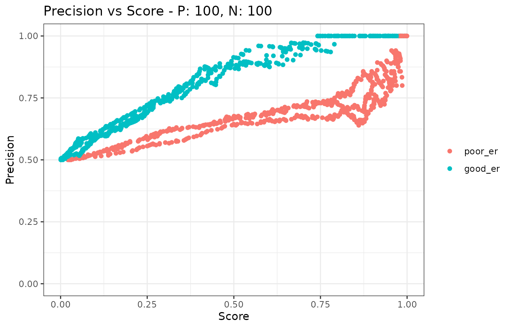

## 16. Multiclass evaluation

A dataset with more than two classes is evaluated by one-vs-rest
decomposition: each class becomes its own binary problem - that class
against all the others - so the accurate precision-recall calculations
apply to it unchanged.

### One-vs-rest curves

Pass a matrix with one score column per class together with the class
labels. The `mmdata` function detects the decomposition, and the classes
are carried on the model axis, so everything downstream treats them as
it would several models on one test set.

``` r

# Load a 3-class dataset with one score column per class
data(C3N150)

# The decomposition is detected from the input
mcmdat <- mmdata(C3N150$scores, C3N150$labels)
mcmdat
```

    ## 
    ##     === Input data ===
    ## 
    ##      Model name Dataset ID Class # of negatives # of positives
    ##    1         c1          1    c1            100             50
    ##    2         c2          1    c2            100             50
    ##    3         c3          1    c3            100             50

``` r

# One curve per class
mccurves <- evalmod(mcmdat)
```

`multiclass = "ovr"` asks for the decomposition explicitly, which is
worth doing when the score columns are not named after the classes -
they are then taken in the order of the class names.

### Per-class and macro-averaged AUCs

The `auc` function reports one row per class and curve type, followed by
the macro-average of the per-class scores.

``` r

# Use knitr::kable to display the result in a table format
knitr::kable(auc(mccurves))
```

| modnames      | dsids | curvetypes |      aucs |
|:--------------|------:|:-----------|----------:|
| c1            |     1 | ROC        | 0.9732000 |
| c1            |     1 | PRC        | 0.9558435 |
| c2            |     1 | ROC        | 0.7758000 |
| c2            |     1 | PRC        | 0.6550357 |
| c3            |     1 | ROC        | 0.5336000 |
| c3            |     1 | PRC        | 0.4162555 |
| macro-average |     1 | ROC        | 0.7608667 |
| macro-average |     1 | PRC        | 0.6757116 |

### S3 generics

All the S3 generics work as they do for several models.

``` r

# Show ROC and Precision-Recall curves, one line per class
autoplot(mccurves)
```

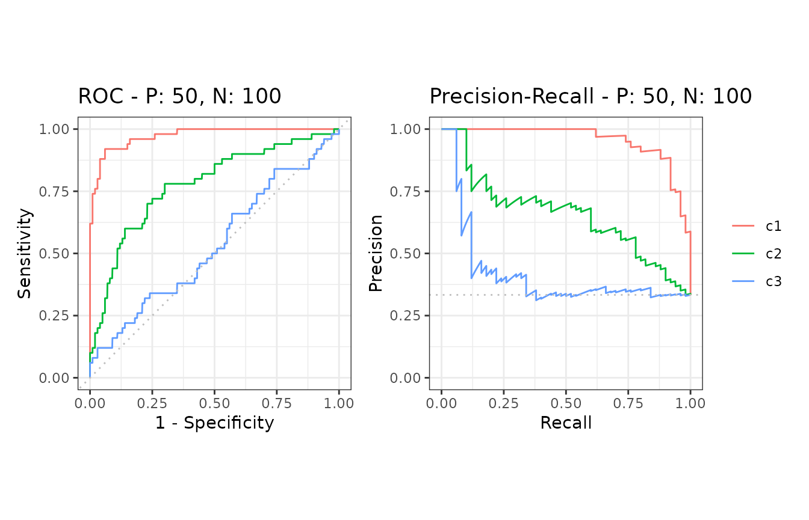

Note that each one-vs-rest decomposition has its own class balance, so
the baseline of a precision-recall curve differs from class to class.
The plots leave the baseline out for that reason - which matters here
more than anywhere else, because a precision-recall curve is read
against its baseline.

## 17. Citation

*Precrec: fast and accurate precision-recall and ROC curve calculations
in R*

Takaya Saito; Marc Rehmsmeier

Bioinformatics 2017; 33 (1): 145-147.

doi:
[10.1093/bioinformatics/btw570](https://doi.org/10.1093/bioinformatics/btw570)

## 18. External links

- [Classifier evaluation with imbalanced
  datasets](https://classeval.wordpress.com/) - our web site that
  contains several pages with useful tips for performance evaluation on
  binary classifiers.

- [The Precision-Recall Plot Is More Informative than the ROC Plot When
  Evaluating Binary Classifiers on Imbalanced
  Datasets](https://doi.org/10.1371/journal.pone.0118432) - our paper
  that summarized potential pitfalls of ROC plots with imbalanced
  datasets and advantages of using precision-recall plots instead.
