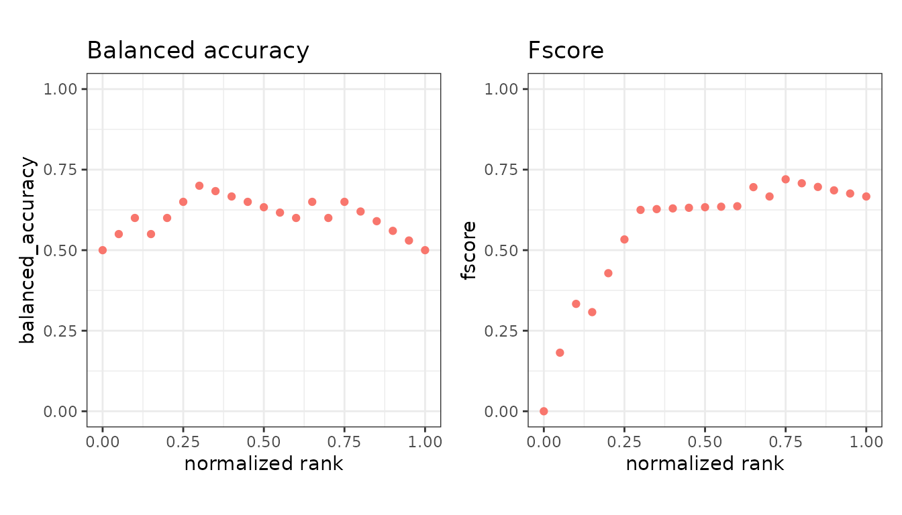
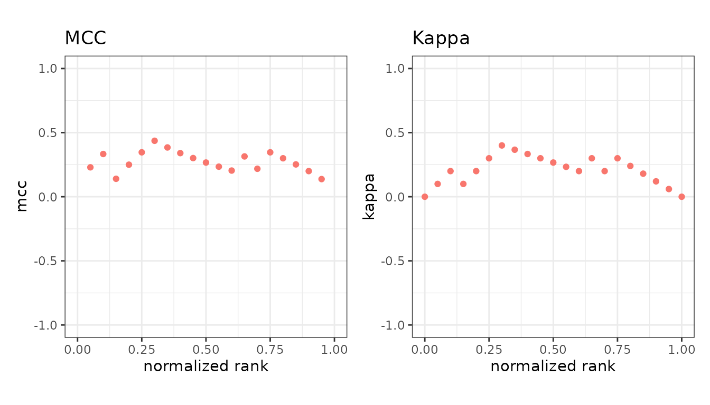
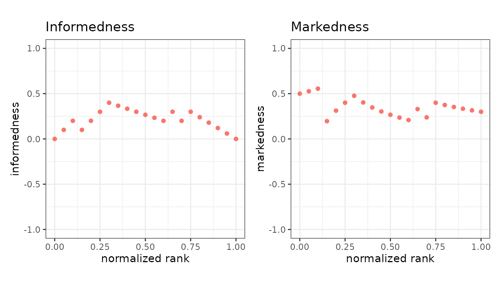

# Agreement and balance

These combine several cells of the confusion matrix into one number that
does not collapse when the classes are imbalanced. All six are in the
default set.

``` r

library(precrec)
library(ggplot2)

points <- evalmod(scores = P10N10$scores, labels = P10N10$labels,
  mode = "basic"
)
```

## Balanced accuracy and F-score

| Measure             | Formula                               | Range  |
|---------------------|---------------------------------------|--------|
| `balanced_accuracy` | (sensitivity + specificity) / 2       | 0 to 1 |
| `fscore`            | harmonic mean of precision and recall | 0 to 1 |

Balanced accuracy is accuracy with both classes weighted equally, so the
majority class cannot carry it on its own.

``` r

autoplot(points, c("balanced_accuracy", "fscore"))
```



`fscore` is the F-beta score and defaults to F1. `beta` weights recall
against precision: `beta = 2` counts recall twice as heavily,
`beta = 0.5` half as heavily.

``` r

f2 <- evalmod(scores = P10N10$scores, labels = P10N10$labels,
  mode = "basic", beta = 2
)
```

## Correlation-like measures

| Measure | Formula                             | Range   |
|---------|-------------------------------------|---------|
| `mcc`   | correlation of prediction and truth | -1 to 1 |
| `kappa` | agreement above chance              | -1 to 1 |

Matthews correlation coefficient uses all four cells of the table, so it
is high only when the classifier does well on both classes. Cohen’s
kappa compares observed agreement against the agreement two raters with
these margins would reach by chance.

``` r

autoplot(points, c("mcc", "kappa"))
```



Both can go negative, meaning worse than chance. Their plots are drawn
on a -1 to 1 axis for that reason.

## Informedness and markedness

| Measure        | Formula                       | Range   |
|----------------|-------------------------------|---------|
| `informedness` | sensitivity + specificity - 1 | -1 to 1 |
| `markedness`   | precision + NPV - 1           | -1 to 1 |

Informedness, also called Youden’s J, is how much better than guessing
the classifier is over the actual classes; markedness is the same idea
over the predicted classes. Their geometric mean is the MCC.

``` r

autoplot(points, c("informedness", "markedness"))
```



## Which to report

For a single number on imbalanced data, `mcc` is the safest of these -
it has no blind spot in any cell of the table. `fscore` ignores the true
negatives entirely, which is usually deliberate but worth knowing.

None of them replaces a curve: each still describes one cutoff, and the
cutoff is a choice you have to justify. See [AUC and other curve
summaries](https://evalclass.github.io/precrec/articles/measures-auc.md).

## Undefined values

`mcc` is `NA` where a row or a column of the table is empty, and `kappa`
is `NA` where chance agreement is exactly 1. Those points are the very
top and bottom of the ranking.

## Next

- [Ranking and
  cost](https://evalclass.github.io/precrec/articles/measures-ranking-cost.md)
- [AUC and other curve
  summaries](https://evalclass.github.io/precrec/articles/measures-auc.md)
