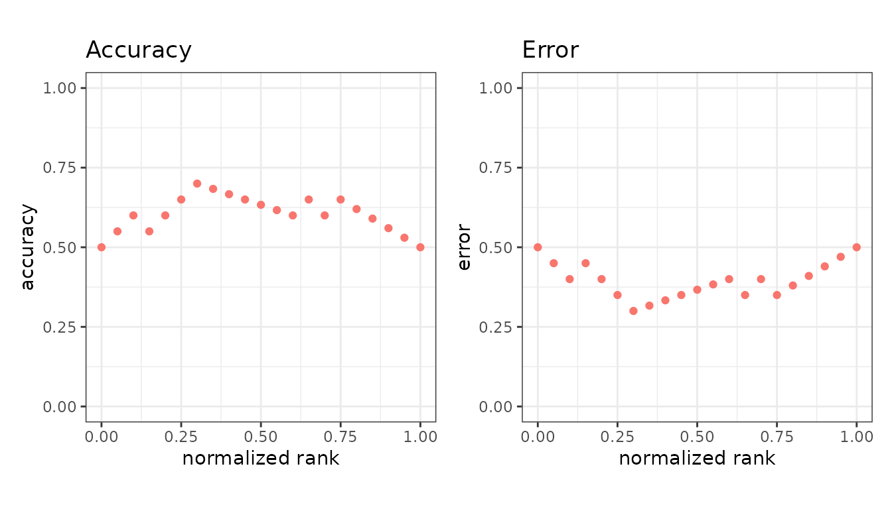
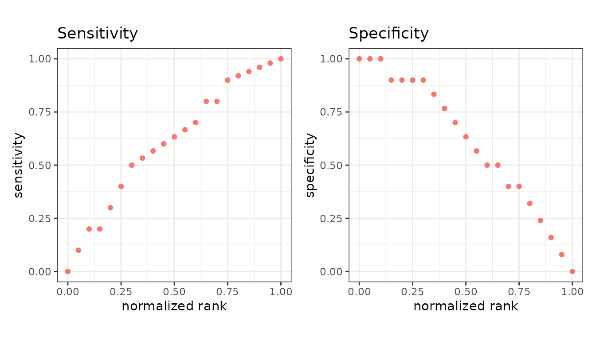
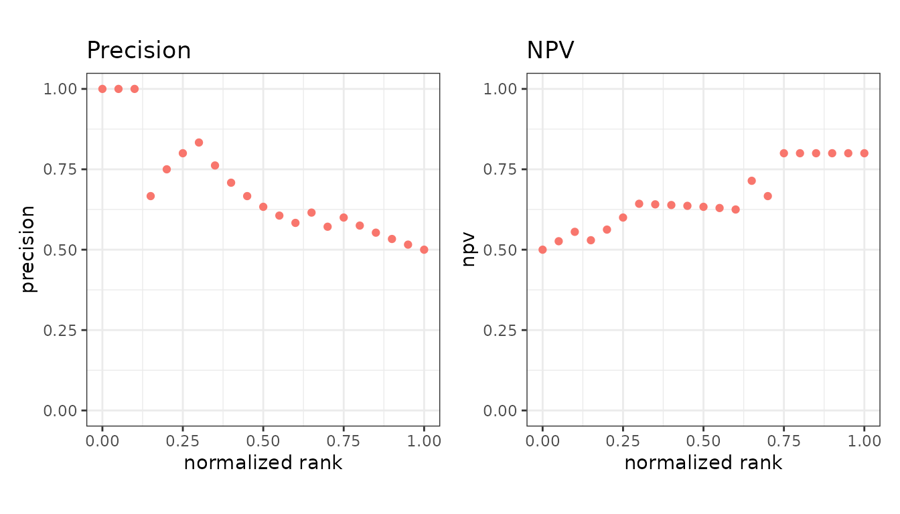
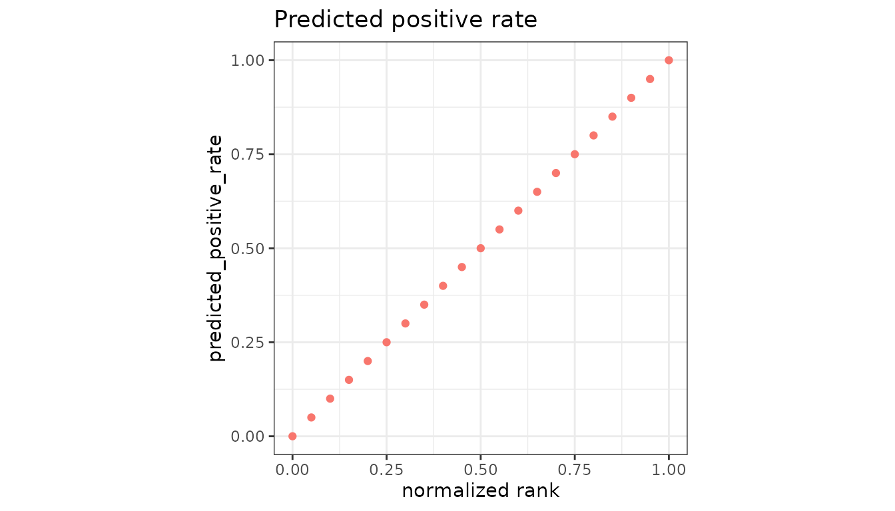

# Confusion-matrix rates

Everything here is a ratio of two cells of the 2x2 table, evaluated at
every cutoff.

|                       | Predicted positive | Predicted negative |
|-----------------------|--------------------|--------------------|
| **Actually positive** | TP                 | FN                 |
| **Actually negative** | FP                 | TN                 |

``` r

library(precrec)
library(ggplot2)

points <- evalmod(scores = P10N10$scores, labels = P10N10$labels,
  mode = "basic"
)
```

## Overall

| Measure    | Formula         | Range  |
|------------|-----------------|--------|
| `accuracy` | (TP + TN) / all | 0 to 1 |
| `error`    | (FP + FN) / all | 0 to 1 |

Accuracy is the measure to distrust first. On data with 1% positives,
calling everything negative scores 0.99.

``` r

autoplot(points, c("accuracy", "error"))
```



## Rates over the actual classes

These divide by a row of the table, so they do not move when the class
balance changes.

| Measure       | Formula        | Also known as              |
|---------------|----------------|----------------------------|
| `sensitivity` | TP / (TP + FN) | recall, TPR, hit rate      |
| `specificity` | TN / (TN + FP) | TNR, selectivity           |
| `fpr`         | FP / (FP + TN) | fall-out, 1 - specificity  |
| `fnr`         | FN / (TP + FN) | miss rate, 1 - sensitivity |

``` r

autoplot(points, c("sensitivity", "specificity"))
```



The ROC curve is `sensitivity` against `fpr`, which is why it is blind
to class balance - both axes are row-wise rates.

## Rates over the predicted classes

These divide by a column, so they *do* move with the class balance. That
is what makes them informative on imbalanced data, and what makes them
impossible to transfer between datasets.

| Measure                | Formula        | Also known as             |
|------------------------|----------------|---------------------------|
| `precision`            | TP / (TP + FP) | PPV                       |
| `npv`                  | TN / (TN + FN) | negative predictive value |
| `false_discovery_rate` | FP / (TP + FP) | 1 - precision             |
| `false_omission_rate`  | FN / (TN + FN) | 1 - NPV                   |

``` r

autoplot(points, c("precision", "npv"))
```



The precision-recall curve is `precision` against `sensitivity` - one
column-wise rate against one row-wise rate. See [balanced and imbalanced
data](https://evalclass.github.io/precrec/articles/howto-imbalanced-data.md).

## How much gets flagged

| Measure                   | Formula         | Also known as                |
|---------------------------|-----------------|------------------------------|
| `predicted_positive_rate` | (TP + FP) / all | rate of positive predictions |
| `predicted_negative_rate` | (TN + FN) / all | rate of negative predictions |

Useful when the cost of review is what constrains you: they say how much
work a cutoff creates, regardless of whether the work is well spent.

``` r

ppr <- evalmod(scores = P10N10$scores, labels = P10N10$labels,
  mode = "basic", metrics = "predicted_positive_rate"
)

autoplot(ppr, "predicted_positive_rate")
```



## Leaving out the true negatives

| Measure | Formula | Also known as |
|----|----|----|
| `jaccard` | TP / (TP + FP + FN) | Jaccard index, critical success index, threat score |

The Jaccard index is the 2x2 table with one corner deleted. Three of the
four cells count toward it and the true negatives do not, which is the
same omission precision and sensitivity make, and it is why the three
move together on imbalanced data while accuracy does not.

That is easiest to see by padding a dataset with negatives the
classifier gets right. Nothing about its handling of the positives has
changed, and the Jaccard index does not move; accuracy climbs, because
on the padded dataset most of what it is counting is the padding.

``` r

best_of <- function(scores, labels, metric) {
  points <- evalmod(scores = scores, labels = labels,
    mode = "basic", metrics = metric
  )
  df <- as.data.frame(points)
  max(df$y[df$type == metric], na.rm = TRUE)
}

# The shipped labels are 1 and -1, and the scores run from 5 to 20, so the
# padding is negatives the classifier scores below all of them
padded_scores <- c(P10N10$scores, rep(0, 200))
padded_labels <- c(P10N10$labels, rep(-1, 200))

knitr::kable(data.frame(
  dataset = c("P10N10", "P10N10 + 200 easy negatives"),
  jaccard = c(
    best_of(P10N10$scores, P10N10$labels, "jaccard"),
    best_of(padded_scores, padded_labels, "jaccard")
  ),
  accuracy = c(
    best_of(P10N10$scores, P10N10$labels, "accuracy"),
    best_of(padded_scores, padded_labels, "accuracy")
  )
))
```

| dataset                     | jaccard |  accuracy |
|:----------------------------|--------:|----------:|
| P10N10                      |  0.5625 | 0.7000000 |
| P10N10 + 200 easy negatives |  0.5625 | 0.9727273 |

Forecast verification calls the same quantity the critical success index
or threat score, for the same reason: a rare event has so many true
negatives that any measure counting them reports mostly the rarity.

## Undefined ends

Precision has no value at the cutoff where nothing is predicted
positive, and NPV none where nothing is predicted negative. `precrec`
fills each in from its neighbor rather than dropping the point.
`jaccard` needs no such treatment: its denominator is 0 only for a
dataset with no positives at all.

## Next

- [Agreement and
  balance](https://evalclass.github.io/precrec/articles/measures-agreement.md)
- [Ranking and
  cost](https://evalclass.github.io/precrec/articles/measures-ranking-cost.md)
