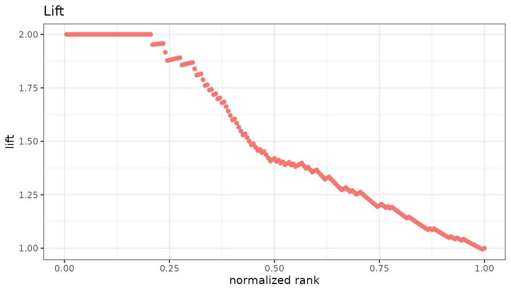
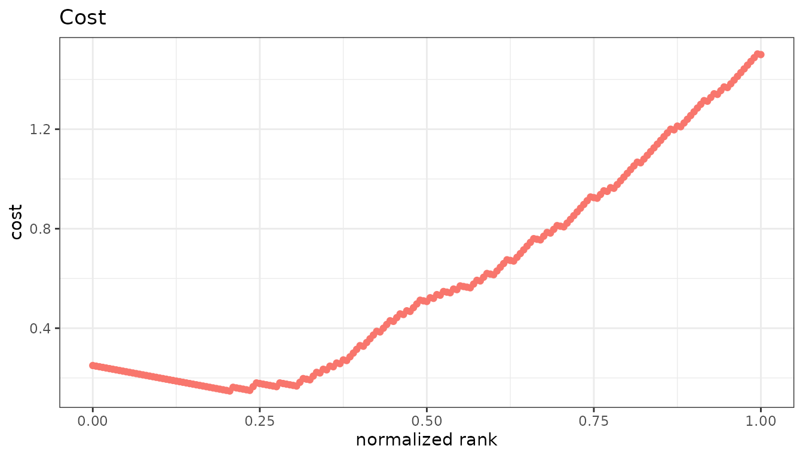

# Ranking and cost

Six measures that answer questions the confusion-matrix rates do not:
how much better than random is this cutoff, how much does it cost, how
much does it tell us. All six are opt-in through `metrics =`.

``` r

library(precrec)
library(ggplot2)

samps <- create_sim_samples(1, 100, 100, "good_er")
```

## Lift and odds

| Measure | Formula                                    | Range    |
|---------|--------------------------------------------|----------|
| `lift`  | sensitivity / rate of positive predictions | 0 upward |
| `odds`  | (TP x TN) / (FN x FP)                      | 0 upward |

Lift is how many times better than random selection the cutoff is: a
lift of 3 means the flagged group holds three times the share of
positives the whole dataset does. It is the standard measure in
marketing and screening, where the question is what to do with a limited
review budget.

The odds ratio is the odds of being positive among the flagged against
the odds among the rest.

``` r

points <- evalmod(
  scores = samps$scores, labels = samps$labels,
  mode = "basic", metrics = c("lift", "odds")
)

autoplot(points, "lift")
```



## Likelihood ratios

| Measure                     | Formula           | Range    |
|-----------------------------|-------------------|----------|
| `positive_likelihood_ratio` | sensitivity / FPR | 0 upward |
| `negative_likelihood_ratio` | FNR / specificity | 0 upward |

These are the two halves of the odds ratio above - LR+ divided by LR- is
exactly `odds` - and they are worth keeping apart because they answer
different questions. LR+ is how much a positive prediction multiplies
the odds that a case really is positive; LR- is how much a negative
prediction multiplies them. A test can be worth using on the strength of
one alone, a large LR+ to confirm or a small LR- to rule out, and the
odds ratio, being the quotient, hides which of the two is doing the
work.

Both are ratios of rates rather than of counts, so neither moves when
the prevalence does. That is what lets a value measured on one
population be carried to another, and it is also the catch: a cutoff
with an excellent LR+ still flags mostly false positives if positives
are rare enough. The measure that answers *that* question is precision,
on the [confusion-matrix
page](https://evalclass.github.io/precrec/articles/measures-confusion-matrix.md).

``` r

lrs <- evalmod(
  scores = samps$scores, labels = samps$labels,
  mode = "basic",
  metrics = c("positive_likelihood_ratio", "negative_likelihood_ratio")
)

autoplot(lrs, "positive_likelihood_ratio")
```


## Cost

`cost` weights the two kinds of error separately:

`(cost_fp x FP + cost_fn x FN) / all`

With the default weights of 1 it is the error rate. Set the weights to
what the two mistakes actually cost you, and the minimum of the curve is
the cutoff to use.

``` r

costs <- evalmod(
  scores = samps$scores, labels = samps$labels,
  mode = "basic", metrics = "cost",
  cost_fp = 3, cost_fn = 0.5
)

autoplot(costs, "cost")
```



The measure is not normalized, following `ROCR`, so its scale is the
scale of the weights you gave.

## Information

| Measure | What it is                                               | Range    |
|---------|----------------------------------------------------------|----------|
| `mi`    | Mutual information between prediction and truth, in bits | 0 to 1   |
| `chisq` | Pearson chi-square of the 2x2 table, `n x mcc^2`         | 0 upward |

Both ask how far the table is from independence rather than how good the
predictions are. They are symmetric: a perfectly wrong classifier scores
as high as a perfectly right one.

## SAR

`sar` is the mean of three things - accuracy, the area under the ROC
curve, and one minus the root mean squared error - proposed as a single
summary that is harder to game than any one of them.

The RMSE part reads the values of the scores rather than their ranks, so
`sar` needs scores that are probabilities between 0 and 1. Given
anything else it warns and returns `NA`, and every other measure asked
for in the same call is still returned.

## Where values are undefined

Several of these are undefined at the very top and bottom of the
ranking, where the 2x2 table has an empty cell.

- `odds` and `chisq` are `NA` there. Some other tools report an infinity
  or a `NaN`; `precrec` reports `NA`, as it already does for the
  undefined end of precision and NPV.
- The likelihood ratios are `NA` over a longer stretch than the others,
  and not only at the ends. `positive_likelihood_ratio` divides by the
  false positive rate, which is 0 for every cutoff above the
  highest-scoring negative, and `negative_likelihood_ratio` divides by
  the specificity, which is 0 from the point where every negative has
  been flagged onward.
- `mi` is `0` there rather than `NA`. A cutoff that predicts one class
  for everything carries no information about the labels, so the value
  is defined and it is zero.

## Next

- [AUC and other curve
  summaries](https://evalclass.github.io/precrec/articles/measures-auc.md)
- [One measure against
  another](https://evalclass.github.io/precrec/articles/plots-metric-curve.md)
