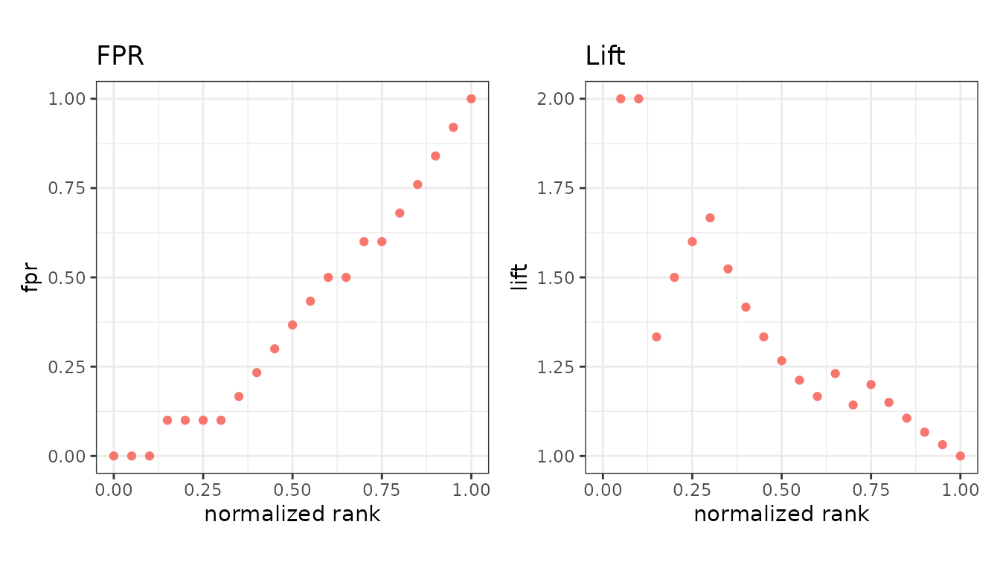

# Metrics overview

`evalmod(mode = "basic")` evaluates metrics at every cutoff of the
score, rather than at one arbitrary threshold. This page is the map;
each family has its own short page.

``` r

library(precrec)
library(ggplot2)

points <- evalmod(
  scores = P10N10$scores, labels = P10N10$labels,
  mode = "basic"
)
```

## The default fourteen

These are calculated whenever you ask for `mode = "basic"`, and each
gets a panel in the default plot.

| Metric | Short | Page |
|----|----|----|
| `score` | `score` | The score itself, for reference |
| `label` | `label` | The observed label, for reference |
| `error` | `err` | [Confusion-matrix rates](https://evalclass.github.io/precrec/articles/metrics-confusion-matrix.md) |
| `accuracy` | `acc` | [Confusion-matrix rates](https://evalclass.github.io/precrec/articles/metrics-confusion-matrix.md) |
| `specificity` | `sp` | [Confusion-matrix rates](https://evalclass.github.io/precrec/articles/metrics-confusion-matrix.md) |
| `sensitivity` | `sn` | [Confusion-matrix rates](https://evalclass.github.io/precrec/articles/metrics-confusion-matrix.md) |
| `precision` | `prec` | [Confusion-matrix rates](https://evalclass.github.io/precrec/articles/metrics-confusion-matrix.md) |
| `npv` | `npv` | [Confusion-matrix rates](https://evalclass.github.io/precrec/articles/metrics-confusion-matrix.md) |
| `balanced_accuracy` | `bacc` | [Agreement and balance](https://evalclass.github.io/precrec/articles/metrics-agreement.md) |
| `fscore` | `fscore` | [Agreement and balance](https://evalclass.github.io/precrec/articles/metrics-agreement.md) |
| `mcc` | `mcc` | [Agreement and balance](https://evalclass.github.io/precrec/articles/metrics-agreement.md) |
| `kappa` | `kappa` | [Agreement and balance](https://evalclass.github.io/precrec/articles/metrics-agreement.md) |
| `informedness` | `infm` | [Agreement and balance](https://evalclass.github.io/precrec/articles/metrics-agreement.md) |
| `markedness` | `mkd` | [Agreement and balance](https://evalclass.github.io/precrec/articles/metrics-agreement.md) |

## The seventeen you ask for

Each of these is another vector the size of your dataset and another
panel in the plot, so they are left out unless named.

| Metric | Also known as | Page |
|----|----|----|
| `fpr` | `fall` | [Confusion-matrix rates](https://evalclass.github.io/precrec/articles/metrics-confusion-matrix.md) |
| `fnr` | `miss` | [Confusion-matrix rates](https://evalclass.github.io/precrec/articles/metrics-confusion-matrix.md) |
| `false_discovery_rate` | `fdr`, `pcfall` | [Confusion-matrix rates](https://evalclass.github.io/precrec/articles/metrics-confusion-matrix.md) |
| `false_omission_rate` | `for`, `pcmiss` | [Confusion-matrix rates](https://evalclass.github.io/precrec/articles/metrics-confusion-matrix.md) |
| `predicted_positive_rate` | `ppr`, `rpp` | [Confusion-matrix rates](https://evalclass.github.io/precrec/articles/metrics-confusion-matrix.md) |
| `predicted_negative_rate` | `pnr`, `rnp` | [Confusion-matrix rates](https://evalclass.github.io/precrec/articles/metrics-confusion-matrix.md) |
| `lift` |  | [Ranking and cost](https://evalclass.github.io/precrec/articles/metrics-ranking-cost.md) |
| `odds` | `odds_ratio` | [Ranking and cost](https://evalclass.github.io/precrec/articles/metrics-ranking-cost.md) |
| `positive_likelihood_ratio` | `lrp` | [Ranking and cost](https://evalclass.github.io/precrec/articles/metrics-ranking-cost.md) |
| `negative_likelihood_ratio` | `lrn` | [Ranking and cost](https://evalclass.github.io/precrec/articles/metrics-ranking-cost.md) |
| `mi` | `mutual_information` | [Ranking and cost](https://evalclass.github.io/precrec/articles/metrics-ranking-cost.md) |
| `chisq` |  | [Ranking and cost](https://evalclass.github.io/precrec/articles/metrics-ranking-cost.md) |
| `cost` |  | [Ranking and cost](https://evalclass.github.io/precrec/articles/metrics-ranking-cost.md) |
| `sar` |  | [Ranking and cost](https://evalclass.github.io/precrec/articles/metrics-ranking-cost.md) |
| `roc_dist` |  | [Agreement and balance](https://evalclass.github.io/precrec/articles/metrics-agreement.md) |
| `sedi` |  | [Agreement and balance](https://evalclass.github.io/precrec/articles/metrics-agreement.md) |
| `jaccard` | `jacc` | [Confusion-matrix rates](https://evalclass.github.io/precrec/articles/metrics-confusion-matrix.md) |

## Asking for them

`metrics =` names the extra metrics. The default fourteen are always
kept, so nothing that worked before changes.

``` r

extra <- evalmod(
  scores = P10N10$scores, labels = P10N10$labels,
  mode = "basic", metrics = c("fpr", "lift")
)

autoplot(extra, c("fpr", "lift"))
```



`metrics = "all"` asks for every metric at once.

Any of the names in the tables above works wherever a metric is named -
in `metrics =`, in
[`plot()`](https://evalclass.github.io/precrec/reference/plot.md) and
[`autoplot()`](https://evalclass.github.io/precrec/reference/autoplot.md),
and on either axis of
[`metric_curve()`](https://evalclass.github.io/precrec/articles/plots-metric-curve.md).
Names given to these metrics by other tools are accepted too, so a call
written against `ROCR` keeps working.

## Not on this page

These have their own functions rather than a column in the table above:

- [AUC and other curve
  summaries](https://evalclass.github.io/precrec/articles/metrics-auc.md) -
  [`auc()`](https://evalclass.github.io/precrec/reference/auc.md),
  [`pauc()`](https://evalclass.github.io/precrec/reference/pauc.md),
  [`auc_ci()`](https://evalclass.github.io/precrec/reference/auc_ci.md),
  [`prbe()`](https://evalclass.github.io/precrec/reference/prbe.md),
  [`average_precision()`](https://evalclass.github.io/precrec/reference/average_precision.md)
- [Probability-based
  metrics](https://evalclass.github.io/precrec/articles/metrics-probability.md) -
  [`prob_metrics()`](https://evalclass.github.io/precrec/reference/prob_metrics.md),
  for scores that are genuine probabilities, and the D2 scores that
  rescale its losses against a null model
- [Classification
  report](https://evalclass.github.io/precrec/articles/metrics-classification-report.md) -
  [`classification_report()`](https://evalclass.github.io/precrec/reference/classification_report.md),
  precision, recall and F-score per class at one operating point you
  choose

Coming from another package? [Comparison with other
tools](https://evalclass.github.io/precrec/articles/metrics-other-tools.md)
maps the names across and shows where the numbers differ.
