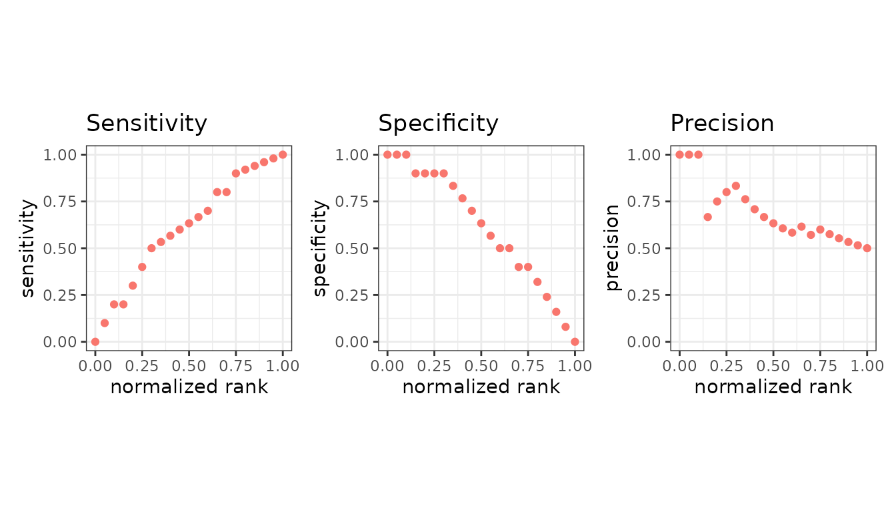
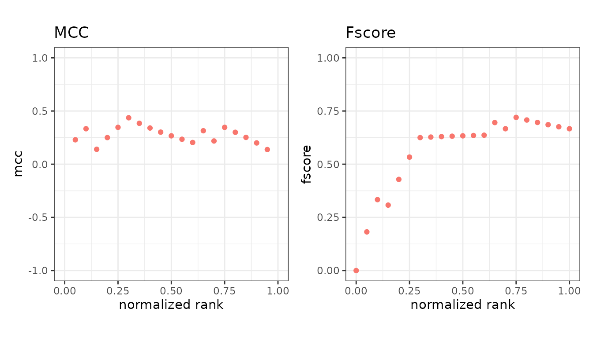
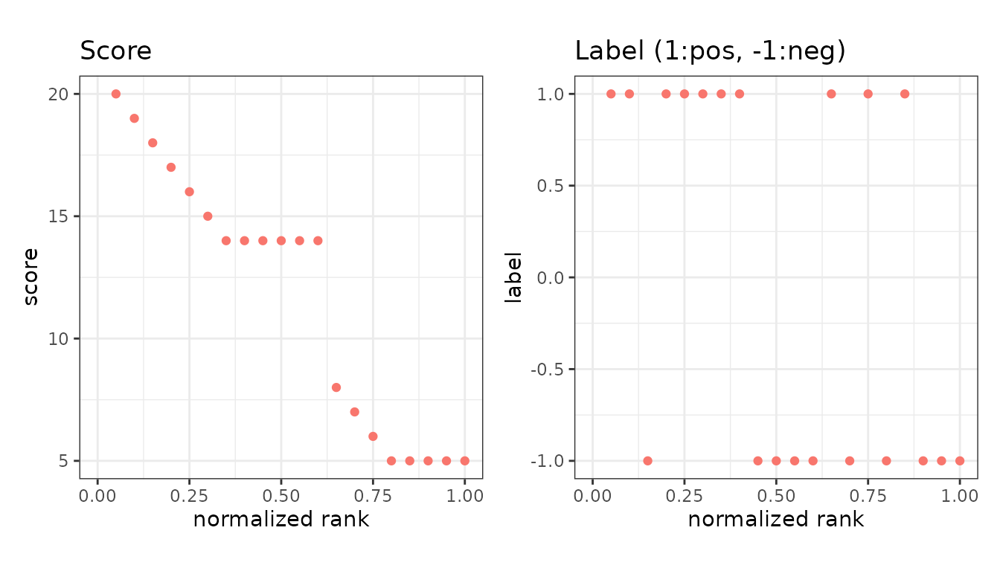
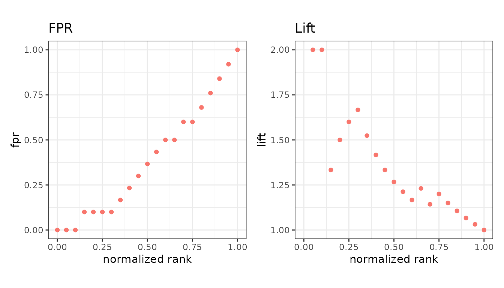

# Basic metric plots

`mode = "basic"` plots evaluation metrics against the normalized rank of
the scores - that is, against how far down the ranked list the cutoff
sits.

``` r

library(precrec)
library(ggplot2)

points <- evalmod(scores = P10N10$scores, labels = P10N10$labels,
  mode = "basic"
)
```

## Pick the panels

Name the metrics you want. Each becomes a panel.

``` r

autoplot(points, c("sensitivity", "specificity", "precision"))
```



``` r

autoplot(points, c("mcc", "fscore"))
```



Called with no metrics, you get all fourteen default panels at once,
which is useful for a first look and too dense for a report.

## Reading the x axis

The x axis runs from 0 to 1 and is the fraction of the dataset above the
cutoff. At x = 0 nothing is predicted positive; at x = 1 everything is.
So the left edge is the strictest cutoff and the right edge the most
permissive.

This is what makes the panels comparable across datasets of different
sizes.

## Scores and labels

Two extra panels show the data behind the metrics rather than a metric:
the score at each rank, and the observed label.

``` r

autoplot(points, c("score", "label"))
```



The label panel is the quickest way to see whether the positives really
are concentrated at the top of the ranking.

## Extra metrics

Anything beyond the default fourteen is requested with `metrics =` and
then plotted the same way.

``` r

extra <- evalmod(scores = P10N10$scores, labels = P10N10$labels,
  mode = "basic", metrics = c("fpr", "lift")
)

autoplot(extra, c("fpr", "lift"))
```



Asking to plot a metric that was not calculated is an error that names
the argument to add. See the [metrics
overview](https://evalclass.github.io/precrec/articles/metrics-overview.md).

## Axis ranges

Metrics that can go negative - `mcc`, `kappa`, `informedness`,
`markedness` and `label` - are drawn on a -1 to 1 axis. The rest use 0
to 1, and the few with no natural bound (`lift`, `odds`, `chisq`,
`cost`, `score`) are scaled to the data.

## Next

- [One metric against
  another](https://evalclass.github.io/precrec/articles/plots-metric-curve.md)
- [Metrics
  overview](https://evalclass.github.io/precrec/articles/metrics-overview.md)
