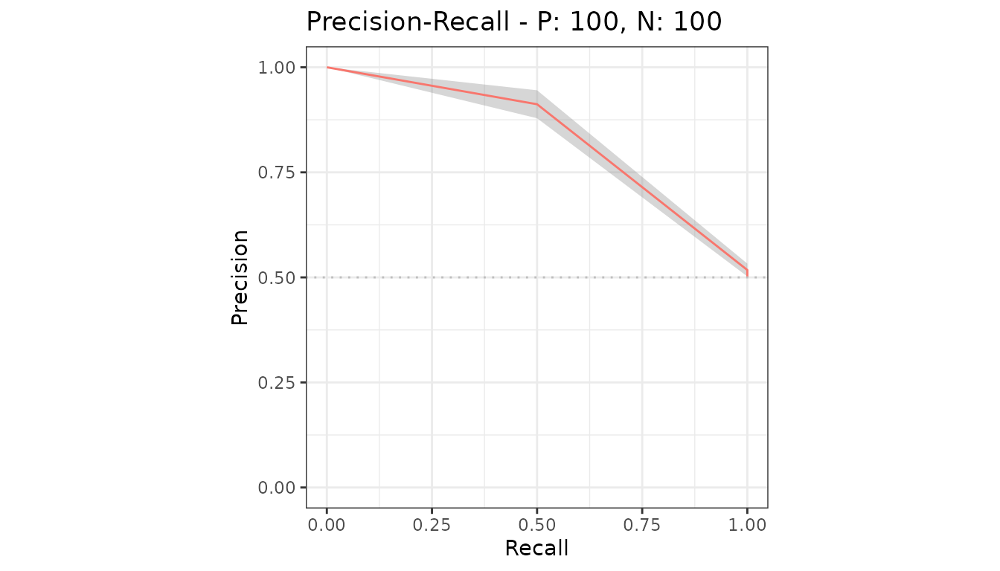
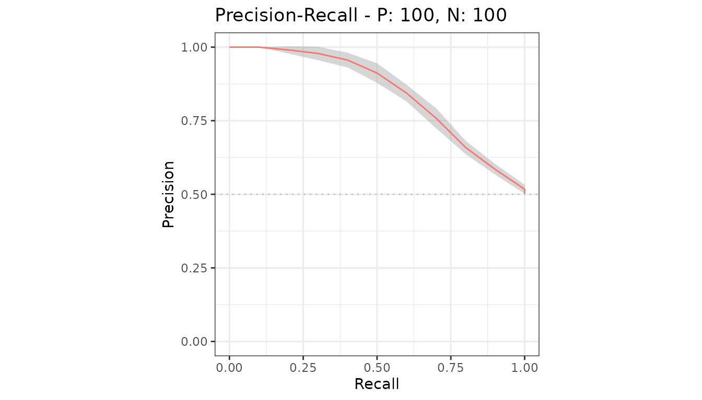
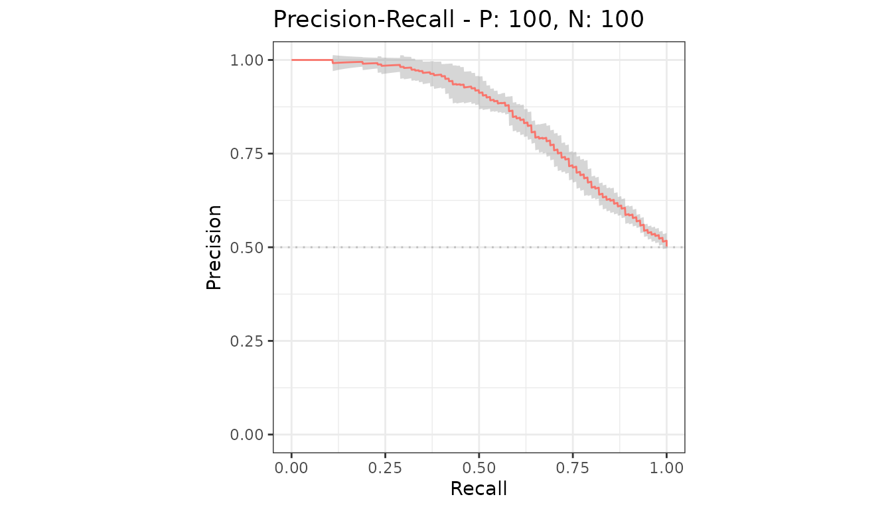
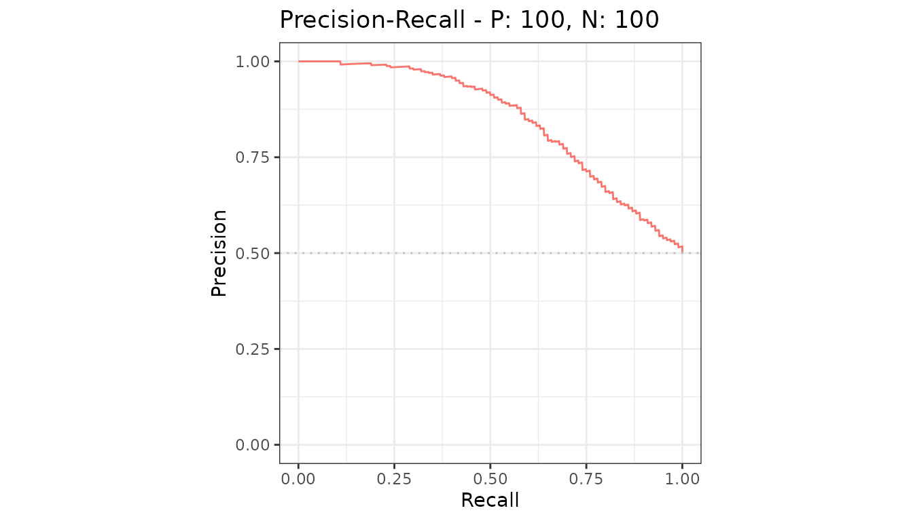

# Confidence bands

When a model has more than one test set, `precrec` averages the curves
and draws a point-wise confidence band around the average. No extra call
is needed.

``` r

library(precrec)
library(ggplot2)

samps <- create_sim_samples(10, 100, 100, "good_er")
mdat <- mmdata(samps[["scores"]], samps[["labels"]], dsids = samps[["dsids"]])
```

## How the average is built

Curves from different test sets have their supporting points in
different places, so they cannot be averaged directly. `precrec`
evaluates each curve at a fixed grid of x values and averages there.
`x_bins` sets how many intervals that grid has.

With `x_bins = 2`, the grid is x = 0, 0.5, 1.

``` r

autoplot(evalmod(mdat, x_bins = 2), "PRC")
```



With `x_bins = 10` it is every tenth.

``` r

autoplot(evalmod(mdat, x_bins = 10), "PRC")
```



The default is 1000, which is smooth at any normal figure size. Lower it
only for very large datasets.

## Setting the level

`cb_alpha` is the significance level: 0.05, the default, gives a 95%
band.

``` r

autoplot(evalmod(mdat, cb_alpha = 0.01), "PRC")
```



## Turning it off

``` r

autoplot(evalmod(mdat), "PRC", show_cb = FALSE)
```



## Showing the individual curves instead

Ask
[`evalmod()`](https://evalclass.github.io/precrec/reference/evalmod.md)
to keep them, then plot them.

``` r

raw <- evalmod(mdat, raw_curves = TRUE)

autoplot(raw, "PRC", show_cb = FALSE)
```


Keeping the raw curves costs memory proportional to the number of test
sets, which is why it is not the default.

## What the band is and is not

It is a point-wise interval: at each x, an interval for the mean y over
the test sets. It is not a simultaneous band for the whole curve, and it
says nothing about how the model would do on data from a different
source.

For an interval on the area rather than the curve, use
[`auc_ci()`](https://evalclass.github.io/precrec/reference/auc_ci.md);
see [AUC and other curve
summaries](https://evalclass.github.io/precrec/articles/measures-auc.md).

## Next

- [Average over several test
  sets](https://evalclass.github.io/precrec/articles/howto-multiple-test-sets.md)
- [Evaluate cross-validation
  folds](https://evalclass.github.io/precrec/articles/howto-cross-validation.md)
