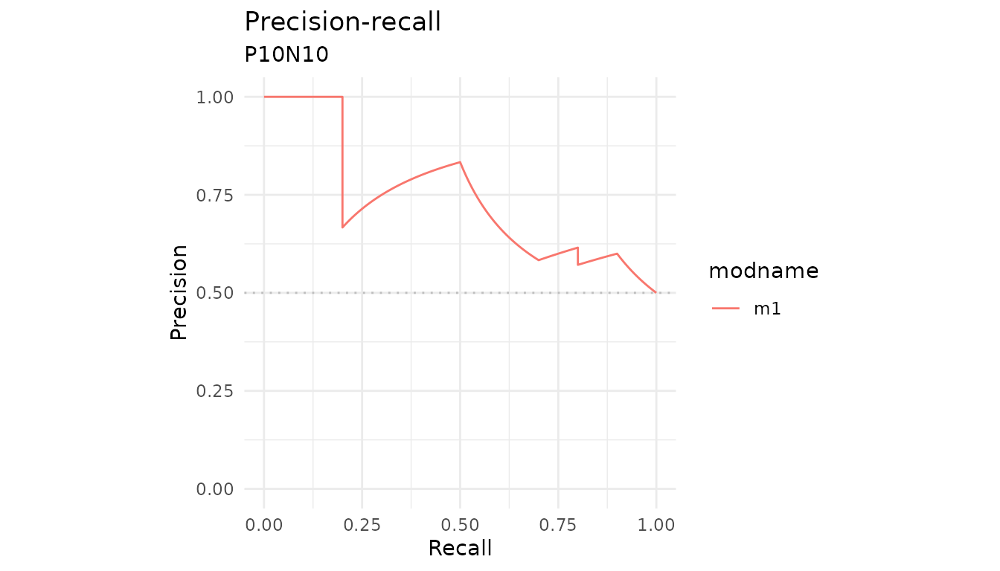
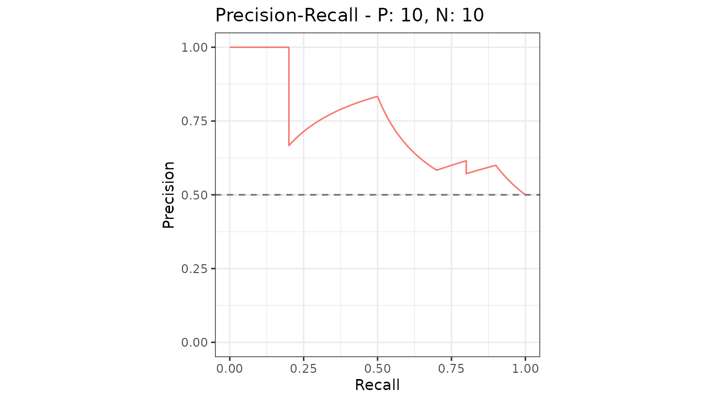
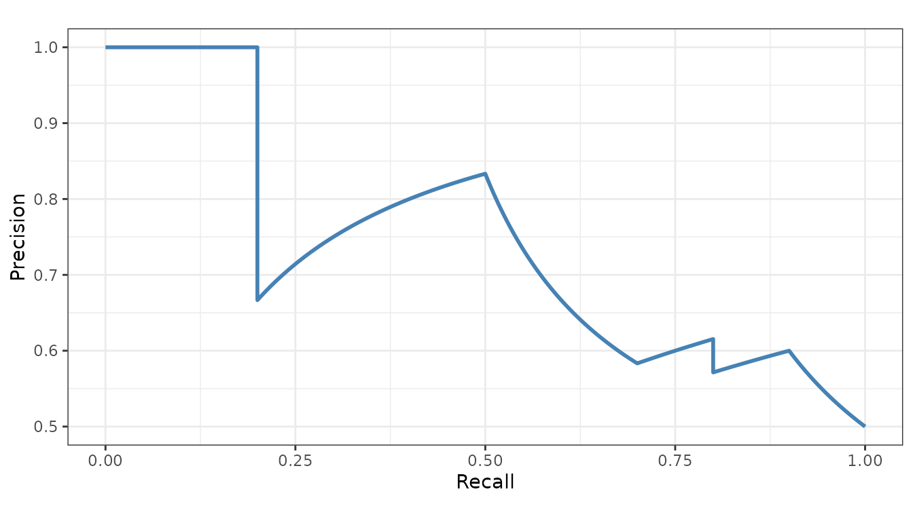
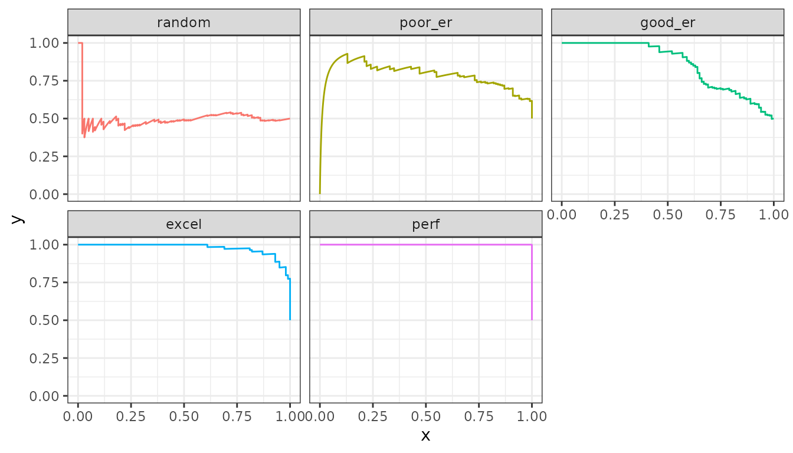

# Customizing plots

[`autoplot()`](https://evalclass.github.io/precrec/reference/autoplot.md)
returns an ordinary `ggplot` object, so the whole of `ggplot2` applies
to it.

``` r

library(precrec)
library(ggplot2)

curves <- evalmod(scores = P10N10$scores, labels = P10N10$labels)
```

## Add layers to the result

``` r

autoplot(curves, "PRC") +
  labs(title = "Precision-recall", subtitle = "P10N10") +
  theme_minimal()
```



## Draw the baseline yourself

The plots leave the precision-recall baseline out, because it sits at
the proportion of positives and that differs between datasets. When you
are looking at one dataset you know the number, so add it.

``` r

baseline <- sum(P10N10$labels == 1) / length(P10N10$labels)

autoplot(curves, "PRC") +
  geom_hline(yintercept = baseline, linetype = "dashed", color = "grey40")
```



## Start from the data instead

[`fortify()`](https://evalclass.github.io/precrec/reference/fortify.md)
is the `ggplot2` hook, so a `precrec` object can go straight into
[`ggplot()`](https://ggplot2.tidyverse.org/reference/ggplot.html) when
you want to build the plot from scratch.

``` r

df <- fortify(curves)
head(df)
#>       x   y modname dsid dsid_modname curvetype
#> 1 0.000 0.0      m1    1         m1:1       ROC
#> 2 0.000 0.1      m1    1         m1:1       ROC
#> 3 0.000 0.2      m1    1         m1:1       ROC
#> 4 0.001 0.2      m1    1         m1:1       ROC
#> 5 0.002 0.2      m1    1         m1:1       ROC
#> 6 0.003 0.2      m1    1         m1:1       ROC

ggplot(subset(df, curvetype == "PRC"), aes(x = x, y = y)) +
  geom_line(color = "steelblue", linewidth = 1) +
  coord_fixed() +
  labs(x = "Recall", y = "Precision") +
  theme_bw()
```



The columns are `x`, `y`, `modname`, `dsid`, `dsid_modname` and
`curvetype` - already in long form, so mapping color or facets to a
model is direct.

``` r

samps <- create_sim_samples(1, 100, 100, "all")
mdat <- mmdata(samps[["scores"]], samps[["labels"]],
  modnames = samps[["modnames"]]
)
mdf <- fortify(evalmod(mdat))

ggplot(subset(mdf, curvetype == "PRC"), aes(x = x, y = y, color = modname)) +
  geom_line() +
  facet_wrap(~modname) +
  theme_bw() +
  theme(legend.position = "none")
```



## Getting the grob

Multi-panel output - both curve types at once, or several measures - is
assembled from separate plots. `ret_grob = TRUE` returns that assembled
object instead of drawing it, for placing in a larger layout.

``` r

g <- autoplot(curves, ret_grob = TRUE)
```

## Base graphics

[`plot()`](https://evalclass.github.io/precrec/reference/plot.md) takes
the usual base arguments, so titles, colors and line types work the way
they do everywhere else.

``` r

plot(curves, "PRC")
```


## Next

- [Plots
  overview](https://evalclass.github.io/precrec/articles/plots-overview.md)
- [Get the numbers
  out](https://evalclass.github.io/precrec/articles/howto-results-as-data.md)
