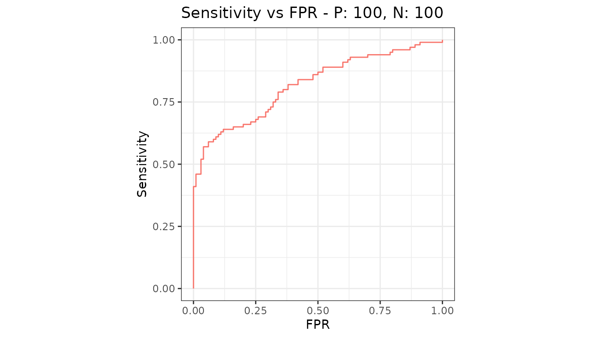
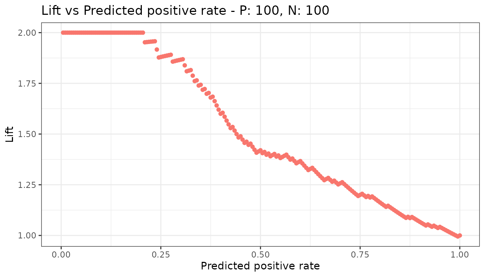
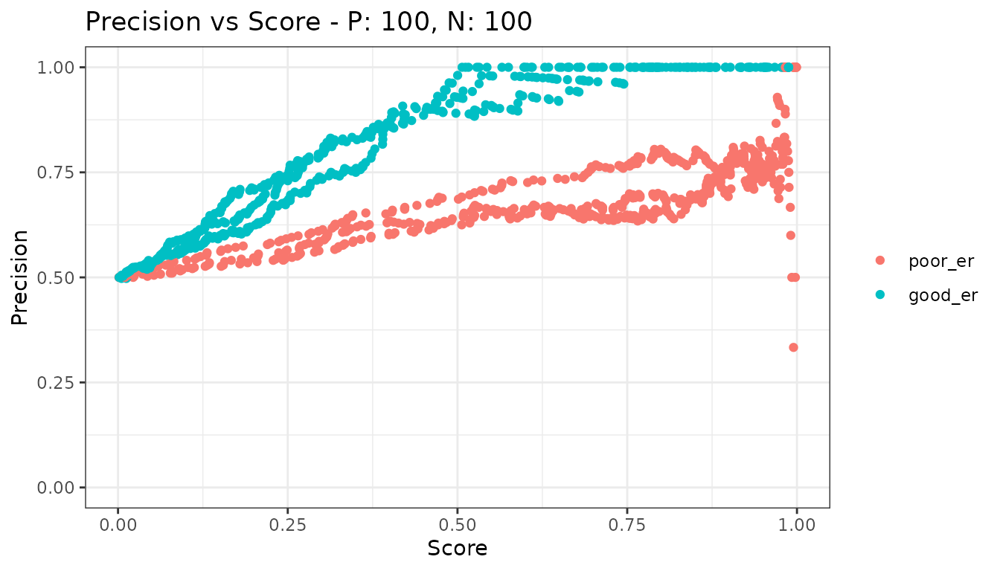

# One measure against another

[`metric_curve()`](https://evalclass.github.io/precrec/reference/metric_curve.md)
takes the name of a measure for the x axis and the name of a measure for
the y axis and draws one against the other. Every measure
[`evalmod()`](https://evalclass.github.io/precrec/reference/evalmod.md)
can calculate is available on both axes.

``` r

library(precrec)
library(ggplot2)

samps <- create_sim_samples(1, 100, 100, "good_er")
```

## The familiar pair

``` r

xy <- metric_curve(
  scores = samps[["scores"]], labels = samps[["labels"]],
  x_metric = "fpr", y_metric = "sensitivity"
)

autoplot(xy)
```



That pair is the ROC curve, and it is the default.

## Anything else, as points

``` r

xy2 <- metric_curve(
  scores = samps[["scores"]], labels = samps[["labels"]],
  x_metric = "predicted_positive_rate", y_metric = "lift"
)

autoplot(xy2)
```



Note the points. That is deliberate, and it is the one thing worth
understanding about this function.

## Which pairs are joined by a line

`precrec` exists because the points of a precision-recall curve must not
be joined by straight lines. The measures this function reads are raw
per-cutoff values with no interpolation, so joining an arbitrary pair of
them would be the very error the package was written to avoid.

Two pairs have a defined interpolation, and only those two are drawn as
curves:

| x             | y             | Curve            |
|---------------|---------------|------------------|
| `fpr`         | `sensitivity` | ROC              |
| `sensitivity` | `precision`   | Precision-recall |

For those two,
[`metric_curve()`](https://evalclass.github.io/precrec/reference/metric_curve.md)
hands the work to the same code `evalmod(mode = "rocprc")` uses, so the
two cannot disagree.

Everything else is drawn as points. Pass `type = "l"` to join them
anyway, having decided that the straight lines mean something for the
pair at hand.

## Several models and test sets

[`metric_curve()`](https://evalclass.github.io/precrec/reference/metric_curve.md)
draws one curve per test dataset and does not average over them. An
average needs a rule for interpolating between the points of each curve,
which is exactly what an unregistered pair does not have. Use
[`evalmod()`](https://evalclass.github.io/precrec/reference/evalmod.md)
for averaged ROC and precision-recall curves.

``` r

samps2 <- create_sim_samples(3, 100, 100, c("poor_er", "good_er"))
mdat <- mmdata(samps2[["scores"]], samps2[["labels"]],
  modnames = samps2[["modnames"]], dsids = samps2[["dsids"]]
)

xy3 <- metric_curve(mdat, x_metric = "score", y_metric = "precision")

autoplot(xy3)
```



## Naming the measures

Both axes accept the long name, the short name, and the name other tools
use - `fall` for `fpr`, `rpp` for `predicted_positive_rate`, and so on.
The [measures
overview](https://evalclass.github.io/precrec/articles/measures-overview.md)
lists them all.

## Next

- [Basic measure
  plots](https://evalclass.github.io/precrec/articles/plots-basic-measures.md)
- [Customizing
  plots](https://evalclass.github.io/precrec/articles/plots-customizing.md)
