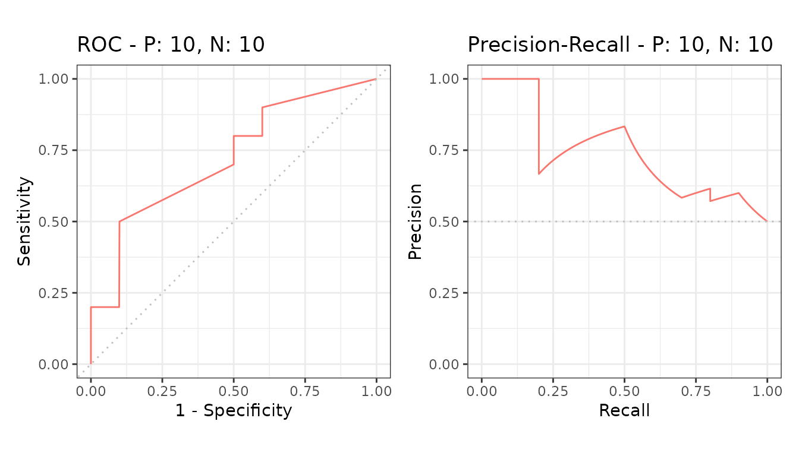
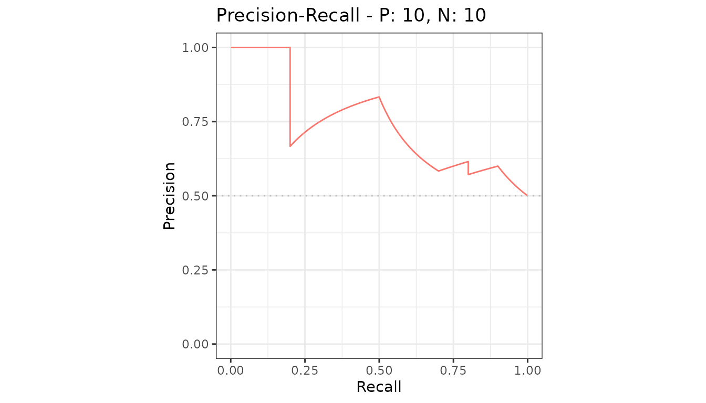
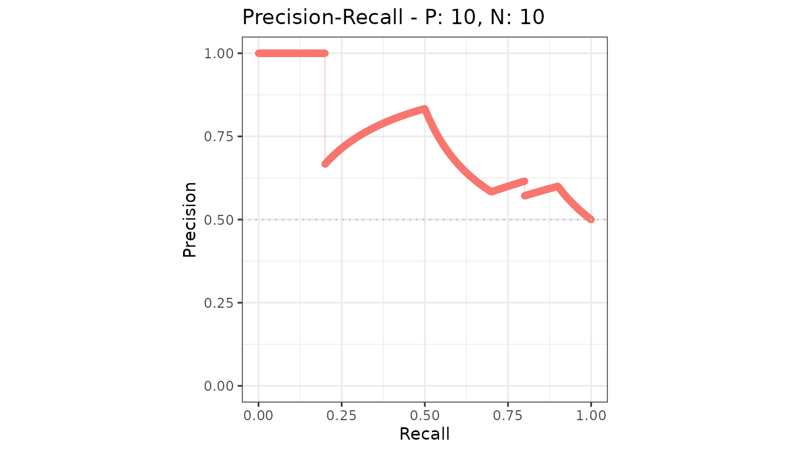

# Plots overview

Every `precrec` object knows how to draw itself two ways.

``` r

library(precrec)
library(ggplot2)

curves <- evalmod(scores = P10N10$scores, labels = P10N10$labels)
```

## plot or autoplot

| Function | Draws with | Use it when |
|----|----|----|
| [`plot()`](https://evalclass.github.io/precrec/reference/plot.md) | base graphics | You want a picture with no dependencies |
| [`autoplot()`](https://evalclass.github.io/precrec/reference/autoplot.md) | `ggplot2` | You want to restyle, relabel or combine the result |

``` r

plot(curves)
```


[`autoplot()`](https://evalclass.github.io/precrec/reference/autoplot.md)
returns a `ggplot` object, so anything you can do to a plot from
`ggplot2` you can do to this one.

``` r

autoplot(curves)
```



## Choosing what to draw

The second argument picks the curve or the metric.

``` r

autoplot(curves, "PRC")
```



For `mode = "basic"` objects it names metrics instead, one panel each.
See [basic metric
plots](https://evalclass.github.io/precrec/articles/plots-basic-metrics.md).

## Arguments both functions share

| Argument        | Effect                                           |
|-----------------|--------------------------------------------------|
| `type`          | `"l"` lines, `"p"` points, `"b"` both            |
| `show_cb`       | Draw the confidence band around an average curve |
| `raw_curves`    | Draw every test set instead of the average       |
| `show_legend`   | Show or hide the legend                          |
| `reduce_points` | Thin the points before drawing; on by default    |

``` r

autoplot(curves, "PRC", type = "b")
```



## The four pages

- [ROC and precision-recall
  curves](https://evalclass.github.io/precrec/articles/plots-roc-prc.md) -
  the main plot
- [Basic metric
  plots](https://evalclass.github.io/precrec/articles/plots-basic-metrics.md) -
  metrics against normalized rank
- [One metric against
  another](https://evalclass.github.io/precrec/articles/plots-metric-curve.md) -
  free-form pairs
- [Confidence
  bands](https://evalclass.github.io/precrec/articles/plots-confidence-bands.md)
  and [partial
  curves](https://evalclass.github.io/precrec/articles/plots-partial-curves.md) -
  the two variations

And [customizing
plots](https://evalclass.github.io/precrec/articles/plots-customizing.md)
for changing what comes out.
