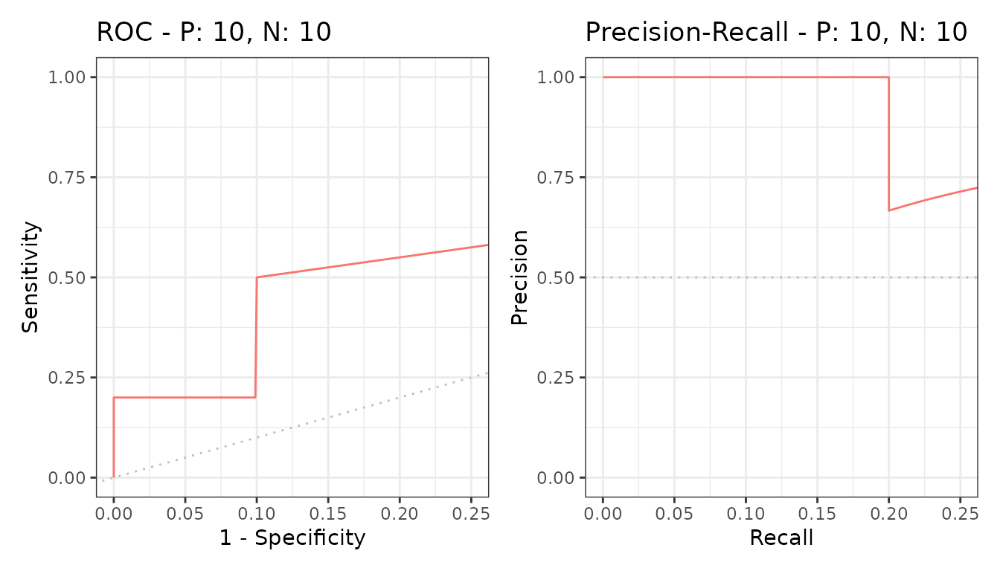
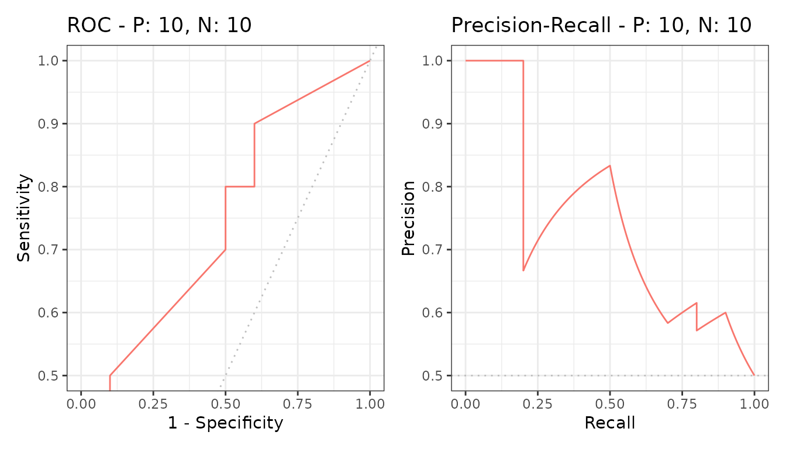

# Partial curves

Often only part of a curve matters - the low-false-positive end when
every alert costs a review, or the high-recall end when a miss is
expensive.
[`part()`](https://evalclass.github.io/precrec/reference/part.md)
restricts a curve to that range.

``` r

library(precrec)
library(ggplot2)

curves <- evalmod(scores = P10N10$scores, labels = P10N10$labels)
```

## Restricting the range

``` r

partial <- part(curves, xlim = c(0, 0.25))

autoplot(partial)
```



The full curve stays visible in outline and the selected part is
highlighted, so the region is read in context rather than in isolation.

`ylim` restricts the other axis, and both can be given at once.

``` r

partial_y <- part(curves, ylim = c(0.5, 1))

autoplot(partial_y)
```



## The areas

[`pauc()`](https://evalclass.github.io/precrec/reference/pauc.md)
returns the area over the restricted range.

``` r

knitr::kable(pauc(partial))
```

| modnames | dsids | curvetypes |     paucs |    spaucs |
|:---------|------:|:-----------|----------:|----------:|
| m1       |     1 | ROC        | 0.1006250 | 0.4025000 |
| m1       |     1 | PRC        | 0.2345849 | 0.9383396 |

`paucs` is the raw area, which is small simply because the range is
narrow. `spaucs` is the standardized version, rescaled to 0 to 1 so that
ranges of different widths can be compared with each other and against a
full AUC.

Report the standardized one unless you have a reason not to. A partial
AUC of 0.18 sounds poor and may be excellent for the quarter of the axis
it covers.

## Several models

[`part()`](https://evalclass.github.io/precrec/reference/part.md) works
on any
[`evalmod()`](https://evalclass.github.io/precrec/reference/evalmod.md)
object, so the comparison carries over.

``` r

samps <- create_sim_samples(1, 100, 100, "all")
mdat <- mmdata(samps[["scores"]], samps[["labels"]],
  modnames = samps[["modnames"]]
)

mpartial <- part(evalmod(mdat), xlim = c(0, 0.25))

knitr::kable(pauc(mpartial))
```

| modnames | dsids | curvetypes |     paucs |    spaucs |
|:---------|------:|:-----------|----------:|----------:|
| random   |     1 | ROC        | 0.0277000 | 0.1108000 |
| random   |     1 | PRC        | 0.1257566 | 0.5030262 |
| poor_er  |     1 | ROC        | 0.1208000 | 0.4832000 |
| poor_er  |     1 | PRC        | 0.2091682 | 0.8366726 |
| good_er  |     1 | ROC        | 0.1511000 | 0.6044000 |
| good_er  |     1 | PRC        | 0.2500000 | 1.0000000 |
| excel    |     1 | ROC        | 0.2284000 | 0.9136000 |
| excel    |     1 | PRC        | 0.2500000 | 1.0000000 |
| perf     |     1 | ROC        | 0.2500000 | 1.0000000 |
| perf     |     1 | PRC        | 0.2500000 | 1.0000000 |

## Next

- [AUC and other curve
  summaries](https://evalclass.github.io/precrec/articles/measures-auc.md)
- [Customizing
  plots](https://evalclass.github.io/precrec/articles/plots-customizing.md)
