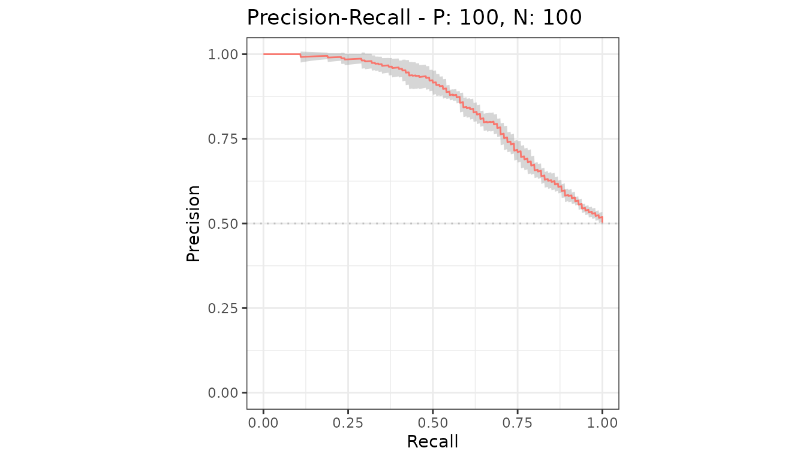
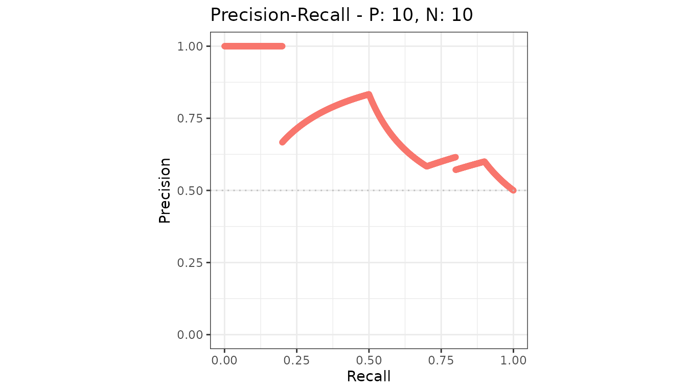

# ROC and precision-recall curves

The default plot of an
[`evalmod()`](https://evalclass.github.io/precrec/reference/evalmod.md)
object: the ROC curve and the precision-recall curve, side by side.

``` r

library(precrec)
library(ggplot2)

curves <- evalmod(scores = P10N10$scores, labels = P10N10$labels)

autoplot(curves)
```


## Reading them

The **ROC curve** plots sensitivity against the false positive rate.
Both axes are rates over the actual classes, so the curve does not move
when the class balance changes. The diagonal is random performance.

The **precision-recall curve** plots precision against recall. Precision
depends on how many negatives there are, so this curve does move with
the class balance - which is exactly what makes it the informative one
on imbalanced data.

## One at a time

``` r

autoplot(curves, "PRC")
```


## Several models

Each model gets its own line and a legend entry.

``` r

samps <- create_sim_samples(1, 100, 100, "all")
mdat <- mmdata(samps[["scores"]], samps[["labels"]],
  modnames = samps[["modnames"]]
)

autoplot(evalmod(mdat), "PRC")
```


## Several test sets

With more than one test set per model, the line is the average and the
shaded region is its confidence band. See [confidence
bands](https://evalclass.github.io/precrec/articles/plots-confidence-bands.md).

``` r

samps2 <- create_sim_samples(10, 100, 100, "good_er")
mdat2 <- mmdata(samps2[["scores"]], samps2[["labels"]],
  dsids = samps2[["dsids"]]
)

autoplot(evalmod(mdat2), "PRC")
```



## Why no baseline is drawn

A precision-recall curve is read against a baseline that sits at the
proportion of positives, and that proportion differs from dataset to
dataset. Drawing one line for several datasets - or several one-vs-rest
classes - would be wrong more often than right, so the plots leave it
out. Add your own with
[`geom_hline()`](https://ggplot2.tidyverse.org/reference/geom_abline.html);
see [customizing
plots](https://evalclass.github.io/precrec/articles/plots-customizing.md).

## Points instead of lines

``` r

autoplot(curves, "PRC", type = "p")
```



## Next

- [Basic measure
  plots](https://evalclass.github.io/precrec/articles/plots-basic-measures.md)
- [Partial
  curves](https://evalclass.github.io/precrec/articles/plots-partial-curves.md)
